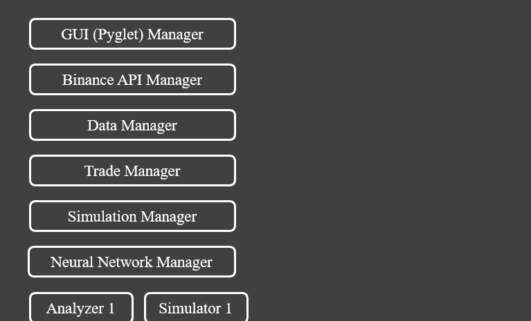

# AutoTradeMachine_Eta

ATM 프로젝트의 일곱번째 버전입니다.

---

### 🧱 시스템 아키텍처 ###

---

### ▶️ 실행 방법 ###
* ***Windows*** 🪟
1. run this file or `./setup.bat`
2. run this file or `./run.bat`

* ***Linux*** 🐧 ***/*** ***MacOS*** 🍎
1. enter this command `chmod +x setup.sh run.sh`
2. run this file or `./setup.sh`
3. run this file or `./run.sh`

---

### 👀 애플리케이션 프리뷰 & 사용법 ###
* 시장
* 실시간 분석
* 투자 전략
* 시뮬레이션 (백테스팅)
* 바이낸스 계정 연결
* 트레이딩
* 뉴럴 네트워크 (재미로만 봐주세요)

---

### 🚫 주의 (매우 중요함)
* 실제 바이낸스 계정 연결과 실시간 자동 매매가 가능하지만, 이 애플리케이션은 **수익성을 보장하지 않습니다**.
* 변동성이 심한 시기의 경우 WebSocket 연결이 끊기거나 `queue overflow`가 발생할 수 있습니다. 해당 상황이 발생하면 프로그램이 자동으로 안정화를 시도할것입니다. 
* 실시간 거래중 PIP 신호가 손실될 수 있습니다. 프로그램이 자동으로 이후 PIP Signal을 받기 위해 재동기화를 할테지만, 해당 kline에 대한 PIP 신호는 Trader가 수신하지 않게되며 중요한 Turning Point에 발생 시 문제를 야기할 수 있습니다.
* 거래 전략 `Trade Scenario (TS)`는 완성되지 않았습니다. 정말 안타깝게도... 개발자는 이 전략을 이용해서 안정적인 수익을 낼 수 있는 경우를 찾지 못해 이 프로젝트를 마무리하며 그대로 미완성 상태로 유지하기로 정했습니다. 이 전략으로 백테스팅을 하거나 시뮬레이션을 돌리려고 한다면 할당된 Simulator 혹은 Trade Manager가 깨질것이므로 시도하지 않기를 권장드립니다. **사용하지 마세요**.

직접 지난 2025년 8월 24일부터 약 3개월동안 매일 24시간 애플리케이션을 구동한 결과, 거래 전략 'Remaining Quantity Percentage Map (RQPM)'을 사용하면서는 유의미한 문제는 찾지 못했습니다. 앞서 설명한 PIP 신호 손실이 생기는 경우가 있었지만, 테스트용도로만 사용하는 애플리케이션으로서는 문제가 없을것입니다. 만약 관심이 간다면, 재미를 위해 직접 AutoTrader 페이지에 들어가서 전략을 세팅한 후, 백테스팅을 해보고 **소량의 투자액**으로 실거래를 한번 해보세요. 아 그리고, 다시 한번 이 애플리케이션은 수익성을 보장하지 않습니다. 투자할 때는 언제나 항상 돈을 잃을 각오를 합시다!

---

### 🤝 크레딧
* **[python-binance](https://github.com/sammchardy/python-binance)** by *sammchardy* (MIT License)  
  - This project includes a modified version of `python-binance`. An option to disable the first kline search within the `futures_historical_klines` function in `client.py` module was added. 

---

### 🗓️ 프로젝트 기간
* 2024년 9월 - 2025년 11월

---

### 📄 문서 정보
* **마지막 업데이트:** 2025년 11월 24일
* **작성자:** 김범수
* **이메일:** kimlvis31@gmail.com
