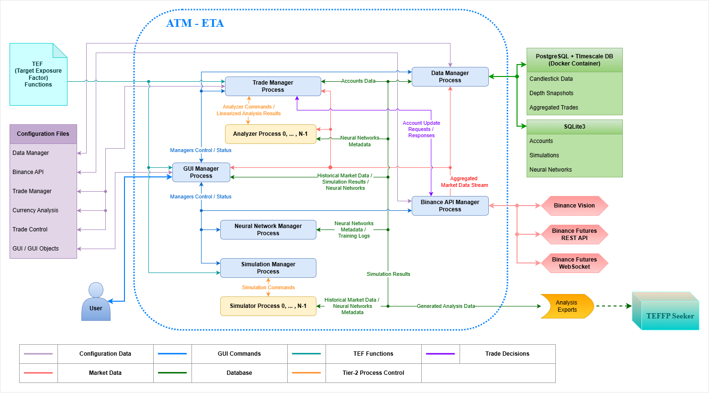
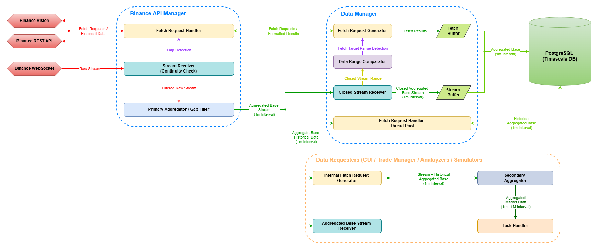
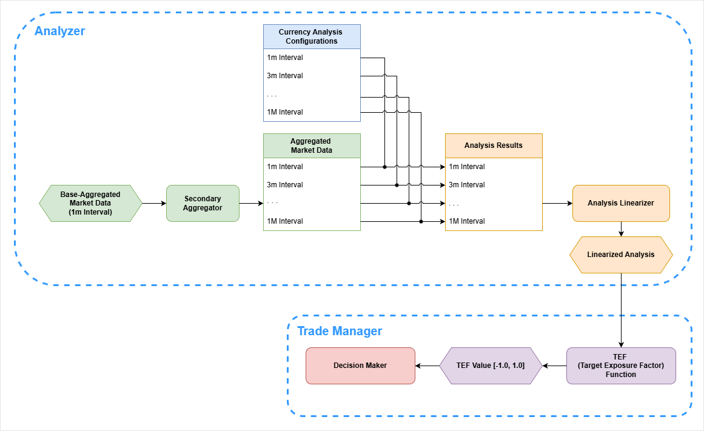
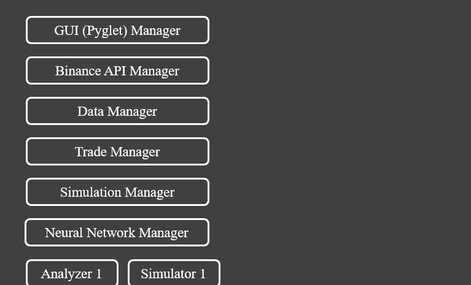
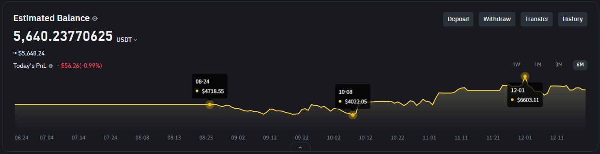

# AutoTradeMachine_Eta

---

### 📖 프로젝트 소개 ###
**Auto Trade Machine Eta (ATM-Eta)** 는 다중 시간대 시장 분석과 실시간 자동 매매를 하나의 애플리케이션에서 통합적으로 제공하는 암호화폐 거래 플랫폼입니다. 전략 연구와 실거래 사이의 간극을 좁히는 것을 목표로 설계되었으며, 사용자는 별도의 도구나 환경 전환 없이 트레이딩 전략을 개발하고, 검증하고, 운용할 수 있습니다.

#### 핵심 기능
* **실시간 시장 데이터 파이프라인** — 애플리케이션 실행 시 Binance Futures 거래소에 자동으로 연결되어 klines, 호가창 스냅샷, 체결 데이터를 지속적으로 수집합니다. 수집된 데이터는 로컬 TimescaleDB 기반의 PostgreSQL 서버에 집계 및 저장되며, 실시간 분석과 백테스팅 모두에 낮은 지연으로 접근할 수 있습니다.
* **커스텀 분석 도구 모음** — 표준 보조지표(MA, PSAR, Bollinger Bands) 외에도 ATM-Eta는 자체 개발한 7개의 하이브리드 분석 도구 — **IVP**, **MMACD**, **DMIxADX**, **MFI**, **TPD**, **WOI**, **NES** — 를 제공합니다. 각 도구는 가격, 거래량, 호가창, 체결 데이터를 통합하여 트레이드 컨트롤러가 활용할 수 있는 일관된 신호 집합을 생성합니다.
* **TEF 기반 전략 정형화** — 트레이딩 전략은 **TEF (Target Exposure Factor)** 라는 하나의 정규화된 스칼라 값(`-1.0` ~ `+1.0`)으로 표현됩니다. 부호는 방향(음수 = SHORT, 양수 = LONG)을, 절대값의 크기는 할당된 자본 대비 목표 포지션 크기를 나타냅니다. 방향과 크기를 단일 유계 값으로 압축함으로써, 임의의 복잡한 분석 로직을 깔끔하고 표준화된 전략 인터페이스로 패키징할 수 있습니다.
* **외부 GPU 가속 최적화** — ATM-Eta에서 추출한 분석 데이터는 별도의 확장 애플리케이션인 **TEFFP Seeker** 에 입력될 수 있습니다. TEFFP Seeker는 GPU 가속 백테스팅 엔진으로, 사용자 정의 전략에 대한 대규모 파라미터 스윕을 병렬로 실행하여, CPU만으로는 현실적으로 탐색이 불가능한 영역에서 최적 파라미터 조합을 찾아낼 수 있도록 지원합니다.
* **신경망 통합 (실험적 기능)** — 사용자는 과거 시장 데이터를 기반으로 커스텀 **MLP (Multi-Layer Perceptron)** 모델을 직접 설계, 학습, 배포할 수 있습니다. 학습된 모델은 Analyzer 또는 Simulator에 보조 신호 소스로 연결할 수 있습니다. 현재는 MLP 구조만 지원합니다.
* **프로세스 격리 아키텍처** — 애플리케이션은 9개 이상의 독립된 프로세스(Main, GUI, BinanceAPI, DataManager, TradeManager, SimulationManager, Analyzer, Simulator, NeuralNetwork)로 구성되어, 자체 IPC 레이어를 통해 통신합니다. GUI 렌더링, 데이터 수집, 분석, 시뮬레이션, 실거래 실행이 서로 독립적으로 동작하며 어느 한 작업도 다른 작업을 블로킹하지 않습니다.

본 플랫폼은 **'Build → Test → Execute'** 워크플로우를 중심으로 설계되어 있으며, 하나의 전략을 코드 재작성이나 환경 변경 없이 백테스트 검증에서 실거래 운용까지 그대로 이어갈 수 있습니다.

---

### ▶️ 실행 방법 ###
애플리케이션을 실행하기 전에 **Docker** 가 시스템에 설치되어 있고 실행 중인 상태여야 합니다. 최초 실행 시 PostgreSQL (TimescaleDB) 서버 컨테이너가 자동으로 구성됩니다.

#### Windows 🪟
1. [Docker Desktop](https://www.docker.com/products/docker-desktop/) 을 설치하고 실행 상태인지 확인합니다.
2. 루트 디렉토리에서 `setup.bat` 을 실행합니다. `.venv` 가 생성되고 필요한 라이브러리가 설치됩니다.
3. 루트 디렉토리에서 `run.bat` 을 실행합니다. 애플리케이션이 시작됩니다.

#### Linux 🐧
1. [Docker Engine](https://docs.docker.com/engine/install/) 을 설치하고 Docker 데몬이 활성화되어 있는지 확인합니다 (`sudo systemctl start docker`).
2. 터미널에서 `chmod +x setup.sh run.sh` 명령을 실행합니다.
3. 루트 디렉토리에서 `setup.sh` 를 실행합니다. `.venv` 가 생성되고 필요한 라이브러리가 설치됩니다.
4. 루트 디렉토리에서 `run.sh` 를 실행합니다. 애플리케이션이 시작됩니다.

---

### ✅ 요구 사양 ###
* **운영체제**: Windows 10/11 또는 Linux
* **Python**: `3.11` 이상
* **CPU**:    8코어 이상
* **RAM**:    16GB 이상
* **저장공간**: 10GB 이상

---

### 🧱 시스템 아키텍처 ###
ATM-Eta는 각 핵심 책임이 독립된 프로세스로 분리되어 동작하는 멀티프로세스 시스템으로 설계되었습니다. 실시간 시장 데이터 수집, GUI 렌더링, 분석, 시뮬레이션, 실거래 실행이 모두 동시에 동작하며, 어느 작업도 다른 작업을 블로킹하지 않습니다. 아래 다이어그램은 외부 입력, 내부 프로세스, 영속 저장소, 그리고 확장 애플리케이션인 **TEFFP Seeker** 와의 연결까지 포함한 전체 구조를 나타냅니다.

모든 프로세스는 `atmEta_IPC.py` 모듈에 정의된 `IPCAssistant` 클래스를 통해 서로 통신하며, 이 클래스는 애플리케이션 전반에 걸쳐 통합된 메시지 전달 인터페이스를 제공합니다.

> **다이어그램에 대한 참고 사항:** 최상위 **Main 프로세스** 는 애플리케이션 생명주기를 관리합니다 — 모든 매니저 프로세스를 spawn하고, 시스템 리소스를 평가하며, 정상적인 종료(graceful shutdown)를 조율합니다. 다이어그램에서는 런타임 데이터 흐름에 집중하기 위해 Main 프로세스를 생략했습니다.

#### 프로세스별 역할

| 프로세스                | 역할 |
| :---:                   | :--- |
| **Main**                    | 애플리케이션 초기화, 시스템 리소스 평가, 워커 프로세스(Analyzer/Simulator) 수 결정, 시작 시퀀스 조율 |
| **GUI Manager**             | 그래픽, 오디오 리소스, 사용자 상호작용 객체를 관리. 사용자 인터페이스와 백엔드 로직을 잇는 중앙 허브 역할 수행 |
| **Binance API Manager**     | 거래소와의 모든 상호작용을 담당하는 게이트웨이. 실시간 시장 데이터 수집, API rate limit 관리, 주문 체결 처리 |
| **Data Manager**            | 로컬 시장 데이터, 계정 정보, 시뮬레이션 기록을 통합 관리하는 저장 엔진. 다른 매니저 프로세스에게 일관된 CRUD 인터페이스 제공 |
| **Trade Manager**           | 트레이딩 운용의 중심 오케스트레이션 단위. 계정 연결, 전략 설정, 로직 결정, Analyzer로의 작업 위임 담당 |
| **Analyzer**                | **Trade Manager** 가 할당한 실시간 시장 분석 작업을 수행 |
| **Simulation Manager**      | 시뮬레이션 세션의 생명주기 관리 및 과거 시뮬레이션 데이터 관리 |
| **Simulator**               | **Simulation Manager** 가 할당한 시뮬레이션 (백테스팅) 작업 수행 |
| **Neural Network Manager**  | 사용자가 과거 데이터를 기반으로 모델을 설계, 학습, 배포할 수 있도록 지원. 학습된 모델은 **Analyzer** 또는 **Simulator** 에 import되어 보조 신호 생성에 활용 |

#### 워커 프로세스 할당

**Analyzer** 와 **Simulator** 워커 프로세스의 수는 `programConfig.config` 파일의 `nAnalyzers`, `nSimulators` 파라미터를 통해 사용자가 직접 설정합니다. 다만 애플리케이션은 런타임에 사용 가능한 CPU 코어 수를 기준으로 이 값들을 제한하여, 설정된 워커 수가 호스트 머신이 감당할 수 있는 범위를 절대 초과하지 않도록 보장합니다.

실제로 spawn되는 워커 수는 다음 로직에 따라 결정됩니다.

$$n_{rem} = \max(N_{CPU} - N_{managers} - 2,\ 0)$$

$$n_{Analyzers} = 1 + \min(n_{rem},\ \texttt{nAnalyzers} - 1)$$

$$n_{Simulators} = 1 + \min(n_{rem} - (n_{Analyzers} - 1),\ \texttt{nSimulators} - 1)$$

여기서 $N_{CPU}$ 는 호스트 머신이 보유한 CPU 코어 수, $N_{managers}$ 는 매니저 프로세스의 수를 의미합니다. `-2` 는 Main 프로세스와 OS 레벨 작업을 위한 여유 코어를 확보하기 위함입니다.

이 할당 정책은 **설정값과 무관하게 최소 1개의 Analyzer와 1개의 Simulator 가 항상 spawn 됨을 보장** 하며, 동시에 리소스가 제한된 환경에서 코어 oversubscription이 발생하지 않도록 합니다. CPU 자원이 부족할 경우에는 Simulator 보다 Analyzer 에 우선 할당되는데, 이는 실시간 분석이 실거래 운용에서 핵심적인 반면 시뮬레이션은 오프라인 작업이기 때문입니다.

> **참고:** Neural Network 모듈은 머신러닝 기반 시장 분석의 가능성을 탐구하기 위한 실험적 기능입니다. 현재는 MLP 구조만 지원합니다.

---

### 📥 시장 데이터 파이프라인 ###

아래 다이어그램은 외부 바이낸스 서비스부터 Binance API Manager와 Data Manager, 데이터베이스 서버를 거쳐 최종적으로 데이터 소비자(Data Consumers)에게 전달되는 데이터 흐름을 보여주는 간소화된 마켓 데이터 파이프라인입니다. 전체 구현에는 상태 관리(bookkeeping) 및 오류 처리 경로가 포함되어 있으나, 전체적인 구조적 의도를 명확히 전달하기 위해 본 다이어그램에서는 의도적으로 생략했습니다.

이 파이프라인은 실시간 거래와 백테스트 모두에 필요한 유연성을 유지하면서 네트워크 부하(footprint), 스토리지 비용, 하위 컴포넌트의 복잡성을 최소화하기 위한 몇 가지 핵심적인 설계 결정을 바탕으로 구축되었습니다.
  
 
   
#### 단일 베이스 인터벌 및 온디맨드 집계

파이프라인 전반에 걸쳐 모든 마켓 데이터는 **1분(1-minute) 베이스 인터벌**을 기준으로 수집, 처리 및 저장됩니다. 상위 타임프레임(5분, 15분, 1시간, 4시간 등)은 **별도로 저장되지 않으며**, 대신 실제 해당 데이터가 필요한 시점에 각 데이터 요청자(Data Requester) 내부의 Secondary Aggregator에 의해 **온디맨드(on-demand) 방식으로 생성**됩니다.

이러한 접근 방식은 두 가지 핵심적인 이점을 제공합니다:

* **네트워크 부하 감소 (Network Footprint)** — 하위 작업에서 얼마나 많은 종류의 타임프레임을 요구하든, 심볼(symbol)당 단 하나의 1분 스트림 구독만 필요합니다. 각 타임프레임을 개별적으로 구독하는 단순한 설계를 사용할 경우, 활성화된 타임프레임의 수에 비례하여 웹소켓 부하가 배수로 증가하게 됩니다.
* **스토리지 효율성 및 DB 구조 단순화 (Storage Efficiency & DB Simplicity)** — 1분 베이스 데이터만 저장함으로써 물리적인 스토리지 용량을 최소화합니다. 더 중요한 점은, 이를 통해 데이터베이스 아키텍처와 데이터 수집 로직이 획기적으로 단순해진다는 것입니다. 시스템은 심볼당 단일 데이터셋만 유지하면 되므로, 여러 타임프레임 테이블에 걸쳐 데이터 삽입을 동기화해야 하는 복잡성과 오버헤드를 완전히 제거할 수 있습니다.

 

#### 이기종 스트림 통합 (Heterogeneous Stream Unification)

바이낸스 선물(Futures)은 `kline`, `aggTrade`, `depth`라는 세 가지 서로 다른 고유 구조의 마켓 데이터 스트림을 제공합니다. `kline`은 이미 1분 단위의 고정된 경계로 도착하지만, `aggTrade`와 `depth` 스트림은 이벤트 기반으로 동작하여 그대로 저장하기에는 비현실적인 고용량의 데이터를 생성합니다.

이러한 이기종 스트림을 동일한 1분 베이스 구조로 통합하기 위해, `aggTrade`와 `depth` 모두 바이낸스 API 매니저를 벗어나기 전 **Primary Aggregator 내부에서 시간 단위로 집계(temporally aggregated)**됩니다:

* 동일한 1분 윈도우 내의 `aggTrade` 이벤트들은 분당 데이터로 누적됩니다.
* `depth` 스냅샷은 해당 1분 구간의 가장 마지막 스냅샷만을 유지하는 방식으로 처리됩니다.

이를 통해 두 가지 연쇄적인 이점을 얻을 수 있습니다. 첫째, 데이터 볼륨이 엄청나게 감소합니다(`aggTrade`와 `depth`의 경우 수십~수백 배 감소). 둘째, 세 가지 데이터 타입 모두 구조적으로 동일한 스트림 및 패치(fetch) 핸들링 메서드를 사용하여 처리될 수 있으므로, 타입별 분기 처리(type-specific branching)의 필요성이 최소화됩니다.

 

#### 스트림 연속성 보장 (Stream Continuity Guarantee)

Stream Receiver는 네트워크 연결 끊김, API 요율 제한(rate-limit throttling), 또는 거래소 측의 스트림 중단 등으로 인해 발생하는 웹소켓 데이터의 시간적 공백(temporal gaps)을 지속적으로 모니터링합니다. 공백이 감지되면, 누락된 시간 구간은 즉시 더미 데이터(dummy data)로 채워집니다. 하위 데이터 소비자 입장에서는 복잡한 공백 복구 로직(gap-recovery logic)을 구현할 필요가 없어지며, 단순히 주입된 더미 데이터 항목만 적절히 처리해주면 됩니다.

> 상세한 복구 체계에 대해서는 [Resilience & Recovery](#-resilience--recovery) 섹션에서 다룹니다.

 

#### 데이터 요청자별 분산 서브 파이프라인 (Distributed Sub-Pipelines per Data Requester)

각 데이터 요청자(Analyzer, Simulator, GUI, Trade Manager)는 Data Manager 내부의 중앙 집중식 집계 서비스에 의존하지 않고, **독자적이고 독립적인 서브 파이프라인**(Aggregated Base Stream Receiver, Internal Fetch Request Generator, Secondary Aggregator, Task Handler)을 유지합니다. 이러한 의도적인 설계는 다음 세 가지 문제를 해결합니다:

* **다양한 타임프레임 동시 요구 (Heterogeneous Timeframe Needs)** — 요청자마다 동시에 필요로 하는 타임프레임이 다릅니다. 예를 들어, 5분봉을 모니터링하는 Analyzer와 4시간봉을 백테스트하는 Simulator가 동시에 실행될 수 있습니다. 중앙 집중식 집계를 사용하면 Data Manager가 심볼 및 소비자별로 수많은 타임프레임 파이프라인을 병렬로 유지해야 하므로 엄청난 조정(coordination) 오버헤드가 발생합니다.
* **Data Manager의 책임 최소화 (Minimal Data Manager Responsibility)** — 집계 로직을 소비자 측에 둠으로써, Data Manager의 역할은 데이터 영구 저장, 범위 비교, 데이터 패치(fetch) 조정이라는 세 가지로 좁혀집니다. 특정 태스크에 종속된 타임프레임 로직은 실제 태스크가 수행되는 곳에 위치하게 됩니다.
* **독립적인 생명주기 (Independent lifecycle)** — 각 요청자가 자체적인 상태를 유지하므로, 특정 Data Requester가 실패하거나 재시작하더라도 다른 요청자의 파이프라인에는 아무런 영향을 미치지 않습니다.

 

#### 버퍼를 통한 영구 저장과 TimescaleDB (Buffered Persistence and TimescaleDB)

Data Manager는 수신되는 데이터를 메모리에 누적한 뒤 데이터베이스에 배치 처리 방식으로 플러시합니다. 이 방식은 트랜잭션당 오버헤드를 줄이고, 데이터 수집 시 발생할 수 있는 일시적인 데이터 유입량 급증(Spikes)을 부드럽게 완화해줍니다.

본 시스템은 PostgreSQL 기반의 시계열 확장 프로그램인 **TimescaleDB**를 활용합니다. 이 선택의 가장 큰 이점은 시계열 기반의 네이티브 압축 기능을 통해 스토리지 비용을 획기적으로 줄일 수 있다는 점입니다. 실제로 제가 구동 중인 시스템에서는 약 98GB의 마켓 데이터가 약 21GB로 압축되었습니다 (약 78% 용량 절감).

 

#### ⚠️ 저장장치에 대한 참고 사항 (A Note on Storage Hardware)

**TimescaleDB**를 선택하는 것으로 스토리지에 대한 고민이 끝나는 것은 아닙니다. **PostgreSQL 데이터 디렉토리를 호스팅하는 물리적 드라이브**의 선택 또한 매우 중요합니다. 이 문제는 겉으로 잘 드러나지 않는 미묘한 방식으로 시스템에 장애를 일으킬 수 있기 때문에 특별히 짚고 넘어갈 필요가 있습니다.

데이터베이스 워크로드(특히 PostgreSQL)는 B-tree 인덱스 업데이트와 동시 트랜잭션으로 인해 지속적인 랜덤 I/O(Random I/O) 패턴을 발생시킵니다. 반면, 최근 소비자용 HDD는 순차 쓰기에 근본적으로 최적화된 트랙 레이아웃을 갖춘 **SMR (기와식 자기 기록, Shingled Magnetic Recording)** 방식의 드라이브로 출하되는 경우가 많습니다. SMR 드라이브에서 랜덤 쓰기가 발생하면 펌웨어 내부적으로 비용이 큰 '읽기-수정-쓰기' 작업이 실행됩니다. 

지속적인 데이터베이스 부하가 주어질 경우, 이는 지연된 장애(deferred failure) 형태로 나타납니다. 즉, 초기 데이터 누적 시점에는 드라이브의 캐시 덕분에 시스템이 정상적으로 작동하지만, 캐시가 고갈되고 나면 I/O 처리 속도가 극단적으로 떨어지며, **이러한 지연은 내부 데이터 큐의 병목 현상 및 스킵을 유발하고, 궁극적으로 인덱스 손상 에러(index corruption errors)를 발생시킵니다.** 이는 마치 애플리케이션 측의 버그처럼 보일 수 있지만, 실제 근본 원인은 물리적 스토리지 계층에 있습니다.

따라서 지속적인 마켓 데이터 수집을 처리하는 ATM-Eta 환경을 구축할 때는, PostgreSQL 데이터 디렉토리를 **CMR (수직 자기 기록, Conventional Magnetic Recording) HDD**나 가급적이면 **SSD**에 호스팅할 것을 강력히 권장합니다.

---

### 🛡️ 시스템 복구 ###
* **AAF (Account Activation File) System** —

 

* **Account Exchange State Reconciliation** —

 

* **API Rate-Limit Handling** —

 

* **Server Disconnection** — 

 

* **Market Data Gap Detection** —

---

### 📊 다중 시간대 분석 ###
아래 다이어그램은 ATM-Eta가 1차 집계된 1분봉 마켓 데이터를 멀티 타임프레임 분석 파이프라인을 거쳐 하나의 트레이딩 시그널로 변환하는 과정을 나타냅니다. 전체 흐름은 두 개의 협력 모듈로 나뉩니다 — 여러 타임프레임에 걸쳐 정형화된 시그널을 추출하는 **Analyzer**, 그리고 추출된 시그널을 유저 정의 전략을 통해 구체적인 포지션 목표값으로 변환하는 **Trade Manager**.

이 설계의 핵심 전제는 다음과 같습니다: 시스템을 특정 타임프레임 하나에 고정시키는 대신, 활성화된 모든 타임프레임에 대해 동일한 분석을 독립적으로 수행하고 그 결과 전체를 유저 전략에 노출합니다 — 어느 타임프레임이 중요한지, 그리고 그것들을 어떻게 조합할지는 전략이 직접 결정하도록 위임합니다.

#### 타임프레임별 분석

Secondary Aggregator는 1차 집계된 1분봉 마켓 데이터를 활성화된 타임프레임 전체 — 1m, 3m, 15m, ..., 1M — 로 확장합니다. 이후 각 타임프레임은 독립적인 분석 트랙을 따라갑니다:
각 타임프레임은 자신의 **Currency Analysis Configuration** — 어떤 분석(SMA, PSAR, MMACD, IVP, WOI, NES 등)을 어떤 파라미터로 수행할지에 대한 선언적 명세 — 에 따라 동작하며, 자신만의 **Analysis Results** 번들을 생성합니다.
동일한 인디케이터를 타임프레임마다 다르게 설정할 수 있어, 전략은 관심 있는 시그널의 빠른 변형과 느린 변형 양쪽 모두에 접근할 수 있습니다.

 

#### Analysis Linearization

각 타임프레임의 분석 번들들은 **Analysis Linearizer**를 거쳐 하나의 평탄화된 딕셔너리 — **Linearized Analysis** — 로 통합되며, 이 과정에서 (타임프레임, 분석 코드, 서브 필드) 조합 각각이 고유한 최상위 키로 매핑됩니다.

이 단계가 존재하는 이유는 하나입니다: **전략 작성 편의성**. `{interval: {analysisCode: {...}}}` 형태의 중첩 구조는 유저 정의 전략 코드가 분석기의 내부 레이아웃을 알고 직접 순회해야 하도록 강제하며, 모든 전략을 분석기의 내부 표현에 결합시킵니다. 반면 평탄화된 딕셔너리는 전략이 필요한 시그널을 단일 딕셔너리 조회로 참조할 수 있게 해주고, 멀티 타임프레임 분석 표면 전체를 균일한 키-값 네임스페이스로 다룰 수 있게 합니다. 부수적인 이점으로, 이 평탄화된 형태는 오프라인 분석 export에 그대로 직렬화 가능합니다 — TEFFP Seeker가 소비하는 데이터셋의 모든 컬럼은 Linearized Dictionary의 키 하나에 정확히 대응되므로, ATM-Eta(CPU)와 TEFFP Seeker(GPU 가속) 사이의 스키마 변환을 최소화합니다.

 

#### TEF 기반 전략 분리

Analyzer와 Trade Manager 사이의 경계는 이 아키텍처에서 가장 의도적으로 설계된 부분입니다. Analyzer의 책임은 Linearized Analysis를 산출하는 시점에서 끝납니다. 이후 Trade Manager는 유저가 작성한 Python 모듈에서 import된 **유저 정의 TEF Function**을 호출하며, 이 함수는 Linearized Analysis를 입력받아 `[-1.0, +1.0]` 범위의 스칼라 하나를 반환합니다 — 부호는 방향(SHORT / LONG), 크기는 상대적 포지션 크기를 나타냅니다. Decision Maker는 포지션의 **commitment rate**를 이 TEF 값에 지속적으로 맞춰가며, 둘 사이에 괴리가 발생할 때에만 거래를 실행합니다.

이러한 분리는 세 가지 구체적인 이점을 제공합니다:

* **전략 교체 용이성** — 전략을 바꾸는 작업은 다른 TEF 함수 파일을 지정하는 것만으로 끝납니다. Analyzer, 데이터 파이프라인, 주문 실행 경로는 그대로 유지됩니다.
* **CPU와 GPU 양쪽에서의 이식성** — TEFFP Seeker는 GPU 가속을 위해 전략을 Triton 커널 형태로 재작성할 것을 요구하지만, TEF 인터페이스 계약(Linearized Analysis 입력, 스칼라 출력)은 양쪽에서 동일하게 유지됩니다.
* **유계의 정규화된 전략 인터페이스** — 모든 전략이 계약상 `[-1.0, +1.0]` 범위의 값을 출력하도록 강제되기 때문에, 하위의 포지션 사이징, 레버리지 할당, 리스크 관리 로직은 한 번만 작성하면 전략의 내부 로직 복잡도와 무관하게 모든 전략에서 재사용 가능합니다.

---

### 🎯 트레이드 로직 파이프라인 ###

---

### 👀 애플리케이션 프리뷰 & 사용법 ###
* 시장
  * ㅇㅁㄴㅇ  
  * 
* 실시간 분석
  * ㅇㅁㄴㅇ  
* 투자 전략
  * ㅇㅁㄴㅇ  
* 시뮬레이션 (백테스팅)
  * ㅇㅁㄴㅇ  
* 바이낸스 계정 연결
  * ㅇㅁㄴㅇ  
* 트레이딩
  * ㅇㅁㄴㅇ  
* 뉴럴 네트워크 (재미로만 봐주세요)
  * ㅇㅁㄴㅇ  

---

### 🔬 실거래 안정성 테스트 ###

전체 시스템을 장기간에 걸쳐 검증하기 위해, 본인의 Binance Futures 계정에서 약 4개월간 애플리케이션을 실제로 운용해 보았습니다. 아래 차트는 해당 기간 동안의 실제 잔고 변동 기록입니다.

| 항목 | 내용 |
| :--- | :--- |
| **운용 기간** | 2025년 8월 24일 ~ 2025년 12월 20일 (약 118일) |
| **거래 종목** | Binance Futures의 `BTCUSDT`, `ETHUSDT`, `XRPUSDT` |
| **전략 출처** | 배포 전 5년치 과거 데이터로 파라미터 튜닝 |
| **백테스트 예측치** | 약 150배 성장, 최대 낙폭(MDD) 약 35% |
| **초기 잔고** | $4,718.55 |
| **최저 잔고** | $4,022.05 (−14.76%) |
| **최고 잔고** | $6,603.11 (+39.94%) |
| **최종 잔고** | $5,640.23 (+19.53%) |

**백테스트 예측치에 대해서.** 150배라는 수치는 과거 데이터에 대한 파라미터 과적합(overfitting)으로 인한 과장된 결과일 가능성이 매우 높으며, 본인 또한 이를 실제 운용 시 기대 수익으로 예상하지 않았습니다. 그럼에도 해당 전략을 배포한 이유는, 이번 운용의 목적이 **수익 창출이 아니라 전체 파이프라인이 실거래 환경에서 지속적이고 정상적으로 동작하는지 검증하는 것**이었기 때문입니다.

**실제로 검증된 부분.** 118일간의 운용 기간 동안 시스템은 모든 주문 체결을 안정적으로 처리하였고, 거래소와의 포지션 및 잔고 동기화를 유지하였으며, 네트워크 단절, API rate limit 도달, 데이터 스트림 끊김 등의 상황에서 수동 개입 없이 자동으로 복구되었습니다. 이는 수익 시연이 아닌 안정성 검증 목적의 운용으로서 충분한 결과라고 판단했습니다. 실제 최대 낙폭은 백테스트 예측치(약 35%)보다 양호한 수준에서 머물렀고, 동일 기간 기준 수익률 또한 백테스트의 동기간 예측치를 상회하였습니다. 다만 이는 운용 시점의 시장 상황이 우호적으로 맞물린 결과일 가능성이 크며, 전략 자체의 우수성으로 보기에는 어렵다고 판단됩니다.

> ⚠️ **유의사항** — 본 애플리케이션은 **수익을 보장하지 않습니다**. 사용자가 직접 자신의 전략을 구축하고 운용할 수 있는 플랫폼을 제공할 뿐입니다. 백테스트 결과든 실거래 결과든 과거의 성과는 미래의 성과를 보장하지 않으며, 암호화폐 파생상품 거래는 상당한 손실 위험을 동반합니다.

---

### 🤝 크레딧
* **[python-binance](https://github.com/sammchardy/python-binance)** by *sammchardy* (MIT License)  
  - This project includes a modified version of `python-binance`. An option to disable the first kline search within the `futures_historical_klines` function in `client.py` module was added. 

---

### 🗓️ 프로젝트 기간
* 2024년 9월 - 2026년 5월

---

### 📄 문서 정보
* **마지막 업데이트:** 2026년 5월 6일
* **작성자:** 김범수
* **이메일:** kimlvis31@gmail.com
