# AutoTradeMachine_Eta

---
### 📖 Project Introduction ###
This is the seventh and the first operational version of the **Auto Trade Machine** project. 

This all-in-one application serves as a comprehensive platform for backtesting and automated trading on Binance Futures. Upon launch, it automatically connects to the exchange to fetch and retain market data locally, allowing users to rapidly experiment with custom strategies. The application is designed to streamline the 'Build-Test-Execute' trade strategy development cycle, enabling a seamless transition from backtesting to live trading.  
Additionally, it includes several experimental features, such as a basic Neural Network model (Multi-Layer Perceptron), deep market data collection (Orderbook and AggTrades), volume profile interpretation, etc.

To demonstrate the application's potential capabilities, I would like to share my automated trading experience on this application.  

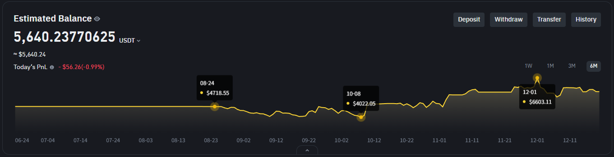

* **Duration:** Running 24/7 since August 24, 2025 (~4 Months) with weekly application restarts.
* **Cryptocurrencies:** `BTCUSDT`, `ETHUSDT`, `XRPUSDT` on Binance Futures.
* **Backtest Result:** ~150x growth over 5 years with ~35% maximum drawdown.
* **Account Balance History:**  
  * **Initial:** $4,718.55  
  * **Minimum:** $4,022.05  
  * **Maximum:** $6,603.11  
  * **Current:** $5,640.23  

The average monthly profit has been around 4.9%, so I have been quite lucky so far. It must be noted, however, that **this application does not guarantee profit**, but only serves as a platform on which users can find their own ways to generate it.

---

### ▶️ How To Run ###
* ***Windows*** 🪟
1. Run `setup.bat` in the root directory. This will setup .venv to install any necessary libraries for this application.
2. Run `run.bat` in the root directory. This will start the application.

* ***Linux*** 🐧
1. Execute the command `chmod +x setup.sh run.sh` in the terminal.
2. Run `setup.sh` in the root directory. This will setup .venv to install any necessary libraries for this application.
3. Run `run.sh` in the root directory. This will start the application.

---

### ✅ Requirements ###
* **Operating System**: Windows 10/11 or Linux
* **Python**:           Version `3.9` or higher
* **CPU**:              Minimum 8-core CPU
* **RAM**:              16GB or more
* **Storage**:          10GB or more

---

### 🧩 Limitations & Current Issues ###
There are some problems that need to be addressed for the application to prove itself more reliable.

* **⚠️ [IMPORTANT] Data Collection Discontinuities**  
  During periods of high market volatility, the application may experience intermittent WebSocket stream disconnections. This instability typically arises from the following factors:
   
  
  1. **Internal Queue Overflow:**
  The application utilizes the `python-binance` library, which employs a threaded WebSocket manager with an internal message buffer. During extreme data volume spikes, this buffer may exceed its capacity, triggering a `queue overflow` exception and terminating the connection. Although the buffer size has been significantly expanded to handle most scenarios, overflows can still occur during unprecedented market activity.
   

  2. **Unstable Network Connection:** 
  The application performs periodic REST API calls to verify server connectivity. Network instability can cause these checks to fail, which the system interprets as a connection loss, triggering a full re-initialization sequence. This recovery process is expensive; it requires fetching missing data via REST API while adhering to strict rate limits. This latency creates unavoidable gaps in data collection, potentially resulting in **PIP signal loss** (detailed in the Strategy section).
   

  3. **Server Overload:** 
  The exchange server may forcefully terminate WebSocket connections during periods of extreme load to ensure overall system stability. Since this behavior originates from the server side, it is inherently unpredictable and difficult to prevent completely.
   
  
  4. **Ping/Pong Mechanism:** 
  To monitor connection status, the Binance server sends a `ping` frame every 3 minutes and expects a `pong` response within 10 minutes. If this handshake fails - potentially due to network latency or application load - the server terminates the connection. While the exact root cause remains under investigation, it is suspected to be linked to transient network instability and the triggered internal connection recovery mechanism.

* **Limited Flexibility In Trade Strategy Customization**  
  Due to its architectural structure, the only means of trade strategy customization currently is adjusting the parameters of pre-existing trading schemes. Consequently, implementing entirely new trade logic requires modifying and testing the source code itself. While this hard-coded approach offers the advantage of runtime stability, it severely restricts flexibility. Furthermore, verifying new logic can be a complex and error-prone process. I recognize that this rigidity contradicts the core purpose of this application. Addressing this issue requires a complete structural redesign, which is planned for the next major version.

* **All-In-One Structure**   
  This application follows an all-in-one architecture, originally adopted to reduce system complexity and enhance user experience. However, this design presents a challenge regarding data collection continuity. While historical Kline (candlestick) data can be retrieved at any time, Binance (and any other exchanges) do not provide historical **Orderbook** or **Executed Trades** data. Consequently, this data must be collected in real-time without interruption. The current architecture requires a full application restart to update any individual module (e.g., Simulator, Trader, GUI), which inevitably severs the data collection stream. These gaps in data compromise the reliability of base datasets for backtesting purposes.

* **Static Process Allocation**  
  All processes in this application are initialized upon launch and persist until termination. Since the numbers of analyzer and simulator processes are dynamically determined by the remaining CPU cores, a 24-core system spawns 24 independent processes that remain active even when there are no tasks to perform. Given that Python processes have a significant memory footprint, this architecture leads to highly unnecessary resource consumption. While core managers (e.g., BinanceAPI, Data, Trader) must remain active, keeping Analyzer and Simulator processes alive during inactivity results in substantial overhead. Consequently, on a 24-core environment, the application can consume nearly 10GB of RAM even in an idle state. I plan to implement a dynamic process lifecycle management system in the next version to resolve this issue.

* **Inefficient Polling-Based Processes & IPC Threads**  
  Currently, the system utilizes a loop-based polling mechanism (with `1ms` sleep) for processes and IPC threads. While this approach ensures sequential task execution, it is inherently inefficient compared to event-driven architectures. The frequent wake-up cycles force unnecessary computations and can result in increased latency becoming a significant bottleneck. This design choice was made during the project's early stages to prioritize implementation simplicity. To remove this unnecessary inefficiency and resource waste, blocking-queue or interrupt-based model will be considered in the next version.

* **Minor GUI Bugs**  
  Listed below are the currently known GUI-related issues. While they can be a nuisance, their impact on the application's core performance is negligible. I believe they can eventually be fixed, but I have not had enough time to invest in them yet.
   
  &nbsp; 1\. Text input box becomes increasingly laggy when holding a long text. Lag becomes noticeable when the length exceeds 30.
   
  &nbsp; 2\. Chart drawer and daily report viewer become slow when scaling in/out over a large time domain or data range.
   
  &nbsp; 3\. Selection box graphics lose synchronization between input and display coordinates when coordinate values exceed around a million.

---

### 🧱 System Architecture ###
The image below shows a simplified diagram of the multiprocessing structure of ATM-Eta.
  
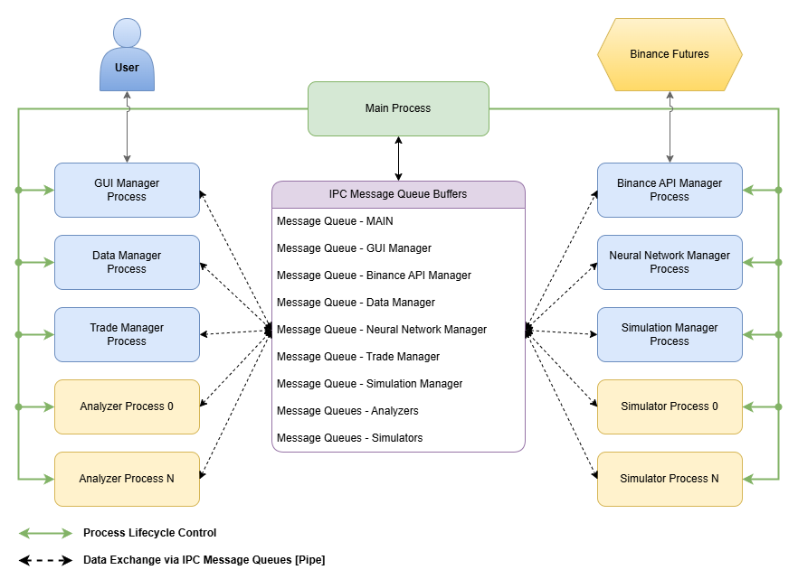
  
All processes communicate with each other via the `IPCAssistant` class defined in the `atmEta_IPC.py` module. The specific roles and responsibilities of each process are described below.

| Process                | Tasks |
| :---:                  | :--- |
| Main                   | Initializes the application, assesses system resources, determines the number of worker processes (Simulators/Analyzers), and orchestrates the startup sequence |
| GUI Manager            | Manages graphics, audio resources, and user interaction objects. Acts as the central hub bridging the user interface with the backend logic |
| Binance API Manager    | Serves as the gateway for exchange interactions, handling real-time market data ingestion, API rate-limit enforcement, and order executio |
| Data Manager           | Centralized storage engine for local market data, account info, and simulation records. Facilitates unified CRUD operations for other manager processes |
| Trade Manager          | The core orchestration unit for trading operations. Manages account connections, strategy configurations, logic determination, and delegates tasks to Analyzers |
| Analyzer               | Executes real-time market analysis tasks as assigned by the **Trade Manager** |
| Simulation Manager     | Oversees the lifecycle of simulation sessions and manages historical simulation data. |
| Simulator              | Performs high-speed backtesting and simulation tasks as assigned by the **Simulation Manager** |
| Neural Network Manager | Enables users to configure, train, and deploy models on historical data. These models can later be imported by `Analyzers` or `Simulators` to generate auxiliary reference data |

The number of analyzers and simulators are determined by the number of CPU cores and `ASRatio` in the `programConfig.config` file.  
$$\text{Number of Analyzers}  = (\text{Number of CPU cores} - 8) \times \text{ASRatio}$$
$$\text{Number of Simulators} = (\text{Number of CPU cores} - 8) \times (1 - \text{ASRatio})$$

> **Note:** The Neural Network module is experimental, designed to test the potential of ML-based market analysis.

---

### 🧠 Trade Strategy ### 
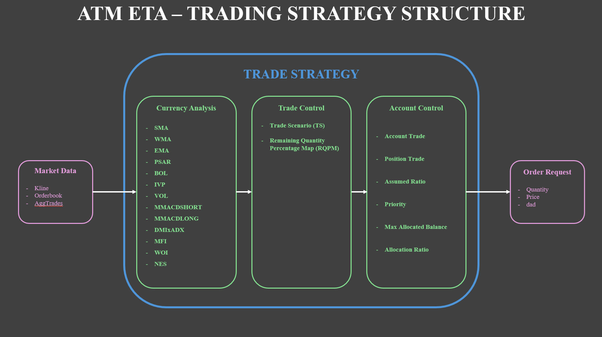

A trade strategy in this application refers to a set of three processes - currency analysis, trade control, and account control. Starting from raw market data, each of these processes uses a pre-defined model and configuration to eventually generate order requests that are sent to the exchange server to be executed.

* 

  
<b><i> Currency Analysis Configuration </b></i>

  Beyond standard technical analysis tools such as MAs, PSAR, and Bollinger Bands, this module incorporates 6 hybrid analysis tools designed for enhanced signal clarity.  

  These individual signals are aggregated and interpreted by the PIP (Potential Investment Plan) tool. PIP acts as a high-level signal aggregator, uniquely designed to interpret and translate raw analytical data.  

  The resulting PIP signal is then captured by the **Trade Control** process to generate actionable execution signals.

  * 
 
    
<b><i> IVP (Interpreted Volume Profile) </b></i>

    The **IVP** module is conceptually based on the widely used **VPVR (Volume Profile Visible Range)** indicator. It aggregates trading volumes across specific price levels to construct a comprehensive volume profile. This raw data is then processed through a filtering algorithm to eliminate noise and pinpoint key structural price levels.

    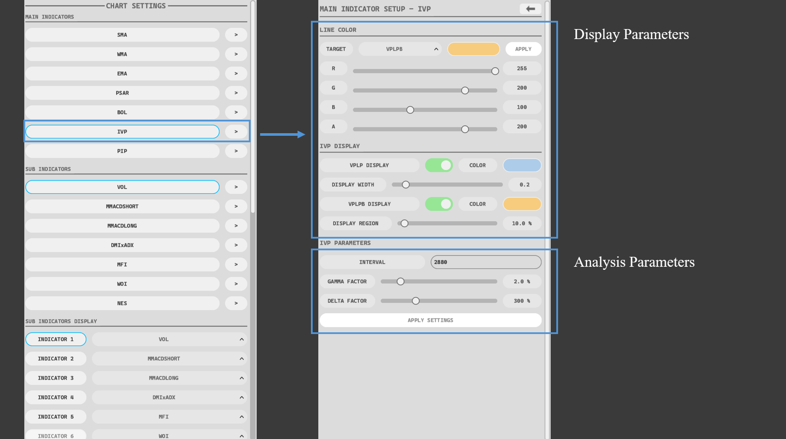

    The table below outlines the configuration parameters for IVP.  
    | Parameter    | Description |
    | :--- | :---  |
    | Interval     | Defines the minimum number of samples required to construct the initial volume profile. Note that data points older than this threshold are **retained** (not excluded), allowing for a cumulative profile |
    | Gamma Factor | Controls the granularity (vertical division height) of the volume profile buckets |
    | Delta Factor | Determines the intensity of the noise filtering |
     

    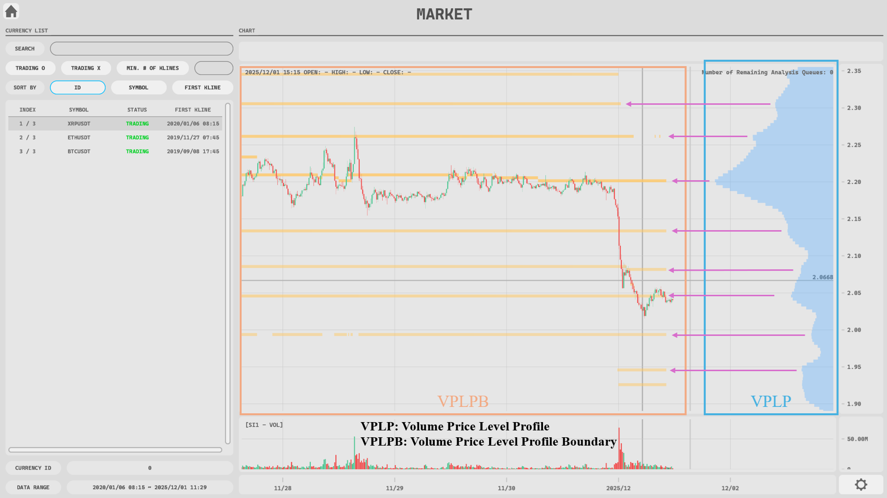

    The image above illustrates the filtered volume profile (**VPLP**) on the right, alongside the identified major support and resistance lines (**VPLPB**).

    

  * 
 
    
<b><i> MMACD (Multi Moving Average Convergence and Divergence) </b></i>

    
    As the name implies, **MMACD** is an expansion of the standard MACD (Moving Average Convergence Divergence) indicator. Unlike the traditional MACD, which tracks the relationship between just two moving averages, MMACD expands this capability to monitor relationships among up to 6 distinct moving averages.

    Furthermore, MMACD incorporates an experimental feature known as **Kline Interval Multiplication**. This allows the system to simulate analysis on higher timeframes without switching the underlying data stream. For example, setting the multiplier to `4` while running on a `15m` domain effectively simulates analysis on a `1h` (15m × 4) timeframe. To leverage this multi-timeframe capability, the system employs two distinct instances: **MMACDSHORT** and **MMACDLONG**.

    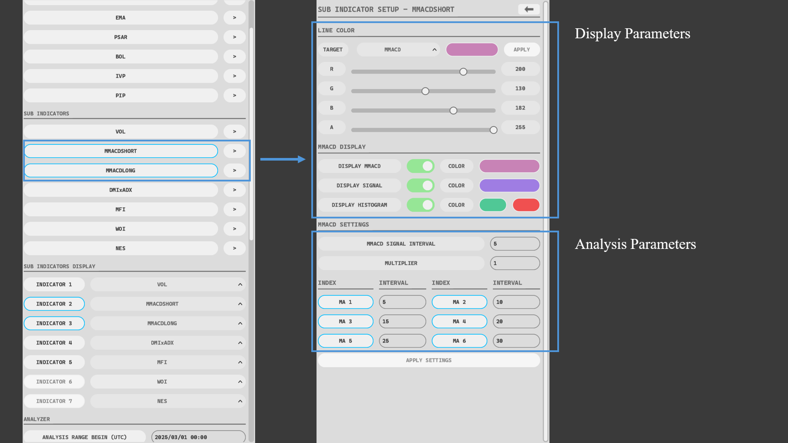

    The table below outlines the configuration parameters for MMACD.  
    | Parameter       | Description |
    | :---            | :--- |
    | Signal Interval | The sampling period for the signal line calculation |
    | Multiplier      | The time-domain multiplication factor. Used to simulate higher timeframe analysis (e.g., 4x multiplier on 15m data ≈ 1h data) |
    | MA Interval     | The base interval for the moving averages |
     

    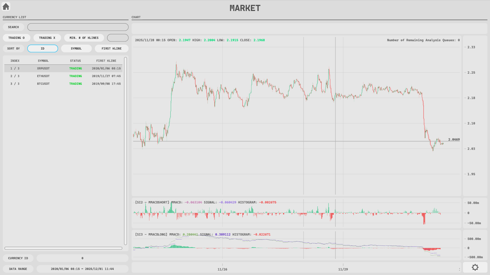

    The image above demonstrates the actual chart data of the MMACD analysis.

    

  * 
 
    
<b><i> DMIxADX (Directional Movement Index and Average Directional Index) </b></i>

    
    This hybrid indicator integrates two standard technical analysis tools:  
    **DMI (Directional Movement Index):** Identifies the direction of the market trend (Bullish/Bearish).  
    **ADX (Average Directional Index):** Identifies the strength of the trend, regardless of its direction.  
    By combining these complementary indicators, the system can assess both the direction and the intensity of market movements.
    
    **ATH (All-Time-High) Relative Representation**  
    Raw values from these indicators can vary significantly, making them ambiguous for automated systems to interpret. To address this, this application adopts an **ATH Relative Representation**. By normalizing the output against its historical maximum value, the indicator provides a standardized and interpretable strength metric, ensuring consistency across different assets and timeframes.

    

    The table below outlines the configuration parameters for DMIxADX.  
    | Parameter | Description |
    | :---      | :--- |
    | Interval  | The number of samples for the signal |
     

    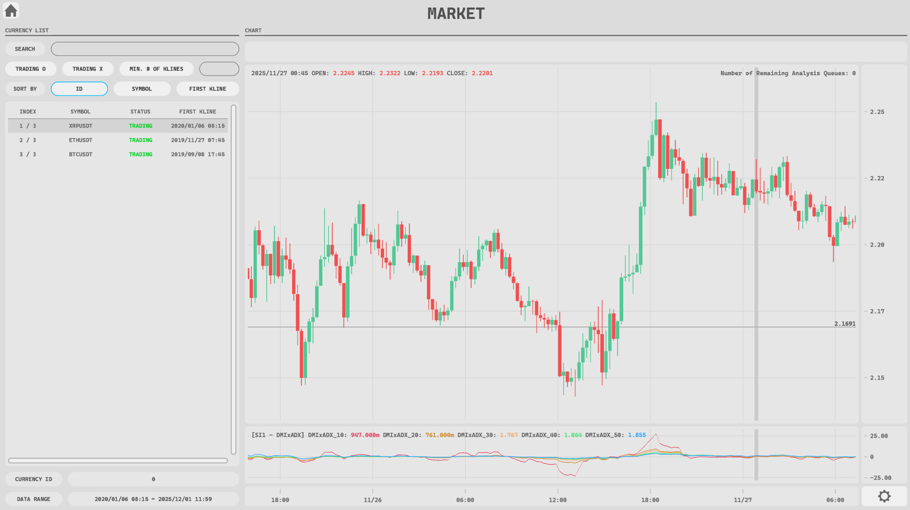

    The image above demonstrates the actual chart data of the DMIxADX analysis.

    

  * 
 
    
<b><i> MFI (Money Flow Index) </b></i>

    The **MFI (Money Flow Index)** is a momentum oscillator designed to measure buying and selling pressure by integrating price and volume data. Similar to the **DMIxADX** module, this tool adopts the **ATH (All-Time-High) Relative Representation** technique. By normalizing the output against historical maximums, it provides a standardized metric that is easier for the automated system to interpret.

    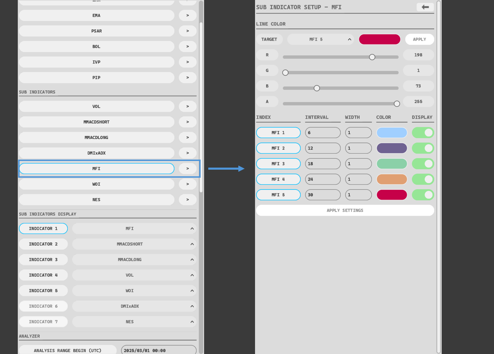

    The table below outlines the configuration parameters for MFI.  
    | Parameter | Description |
    | :---:     | :--- |
    | Interval  | The number of samples for the signal |
     

    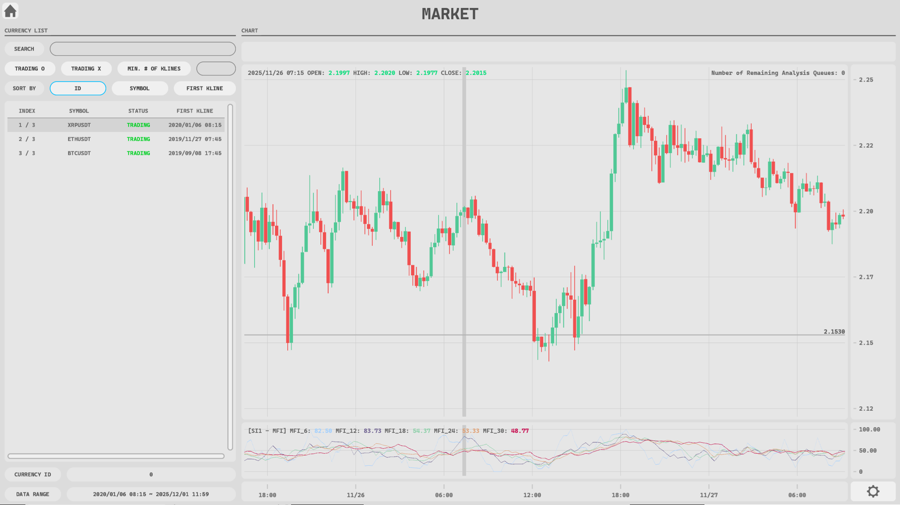

    The image above demonstrates the actual chart data of the MFI analysis.

    

  * 
 
    
<b><i> WOI (Weighted Order Imbalance) </b></i>

    
    The **WOI (Weighted Order Imbalance)** is an orderbook-based indicator, designed to quantify the disparity between average buying and selling pressure.

     **Gaussian Filtering**
    Since raw high-frequency orderbook data is inherently noise-heavy, the output is aggregated over the same **temporal interval** as the active candlestick. Then, **Gaussian Filtering** is applied to smooth out micro-fluctuations, generating a cleaner trend signal.
    
    
    The table below outlines the configuration parameters for WOI.  
    | Parameter | Description |
    | :---:     | :--- |
    | Interval  | Number of samples (interval block) for the Gaussian Filter |
    | Sigma     | Determines the standard deviation of the Gaussian Filter |
     

    > **Note:** This module represents an experimental approach to integrating Level 2 (Orderbook) data into the currency analysis process.

    

  * 
 
    
<b><i> NES (Net Execution Strength) </b></i>

    
    The **NES (Net Execution Strength)** is a volume-based indicator derived from real-time trade execution data (`aggTrades`). Unlike orderbook metrics which represent intent, NES quantifies the **actual executed buying and selling momentum**.

    **Gaussian Filtering**
    Similar to the **WOI** indicator, raw execution data is aggregated and processed using **Gaussian Filtering**. This technique smoothens high-frequency trade noise to generate a coherent and interpretable trend signal.
    
    The table below outlines the configuration parameters for NES.  
    | Parameter | Description |
    | :---:     | :--- |
    | Interval  | Number of samples (interval block) for the Gaussian Filter |
    | Sigma     | Determines the standard deviation of the Gaussian Filter |
     

    > **Note:** This module represents an experimental approach to integrating trade execution data into the currency analysis process.

    

  * 
 
    
<b><i> PIP (Potential Investment Plan) </b></i>

    The **PIP (Potential Investment Plan)** serves as the decision-making core of the currency analysis process. It acts as a **signal aggregator and logic synthesizer**, collecting refined outputs from various upstream indicators (Classical Indicators, Neural Networks, WOI). PIP processes these inputs through a layered filtering logic to generate potential order execution decisions. These finalized signals are subsequently consumed by the **Trade Control** process to determine intermediate trade decisions (which are finalized by the **Account Control** process).

    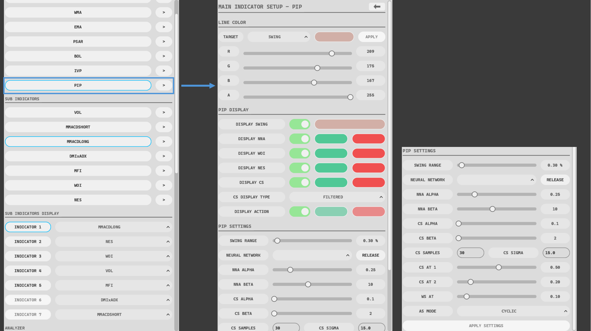

    The table below outlines the configuration parameters for PIP.  
    | Parameter      | Description |
    | :---:          | :--- |
    | SWING Range    | High-Low Swing Points Range |
    | Neural Network | Neural Network Model |
    | NNA Alpha      | Neural Network Analysis Signal Filtering Parameter 1 |
    | NNA Beta       | Neural Network Analysis Signal Filtering Parameter 2 |
    | CS Alpha       | Classical Signal Filtering Parameter |
    | CS nSamples    | Classical Signal Filtering Number of Samples |
    | CS Sigma       | Classical Signal Filtering Parameter 1 |
    | CS AT1         | Classical Signal Activation Threshold 1 |
    | CS AT2         | Classical Signal Activation Threshold 2 |
    | WS AT          | Activation Threshold for WOI Signal |
    | AS Mode        | Action Signal Type |

    | Keyword | Description |
    | :---:   | :---: |
    | AT      | Activation Threshold |
    | NNA     | Neural Network Analysis |
    | CS      | Classical Signal |
    | WS      | WOI Signal |
    | AS      | Action Signal |
     

    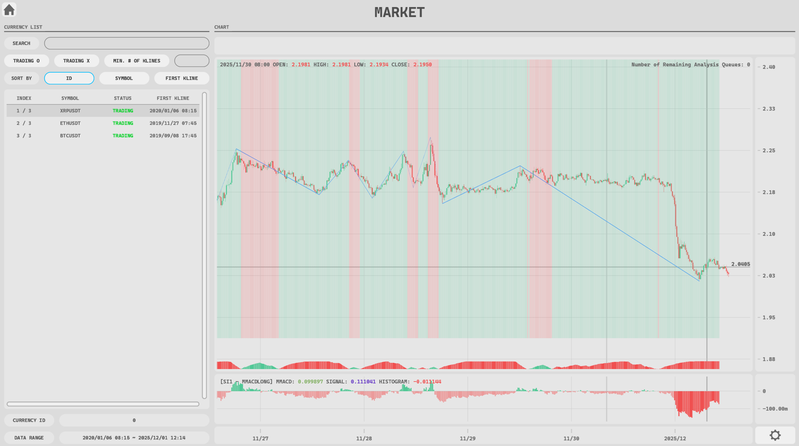

    The image above demonstrates the actual chart data of the PIP analysis.

    

  

* 

  
<b><i> Trade Control Configuration </b></i>

  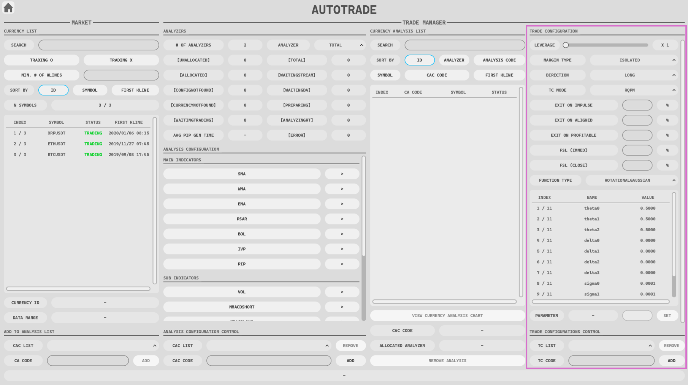

  Trade Control is a process in which potential trade orders are created from the PIP signals generated by currency analysis. This is done by identifing the current position within the trade cycle and corresponding pre-determined reaction models.
  Currently there are two trade control methods implemented; TS (Trading Scenario) and RQPM (Remaining Quantity Percentage Map).

  * 
 
    
<b><i> TS (Trading Scenario) </b></i>

    This is a very primitive type of trade control method. Its idea is extremely simple. The user configures each step of a trade cycle (from position enterance to exit). 
    Each step consists of three parameters; index, PD (price delta), and QD (quantity determination).

    | Parameter | Description |
    | :---:     | :---: |
    | Index     | The order of the step |
    | PD        | Price difference from the initial entrance price |
    | QD        | Quantity percentage to reach relative to the position allocated balance|

    | Parameter    | Contents   | Description |
    | :---:        | :---:      | :---: |
    | FSL (IMMED)  | ACT        | The order of the step |
    | FSL (CLOSED) | ACT        | Price difference from the initial entrance price |
    | WR           | ACT, AMT   | Quantity percentage to reach relative to the position allocated balance |
    | RAF          | ACT1, ACT2 | Quantity percentage to reach relative to the position allocated balance |

    

  * 
 
    
<b><i> RQPM (Remaining Quantity Percentage Map) </b></i>

    The fundamental idea of this method is the same as TS. The difference is while status positional varialbe was limited to index and pride delta for TS, RQPM allows the use of PIP signal to construct a position model, and output quantity percentage
    using a model function. Currently there is only one function type called 'ROTATIONALGAUSSIAN'.  

    $$
    RQP (Remaining Quantity Percentage) = f(PIPSS (PIP Subsignals))
    $$

    | Parameter    | Contents | Description |
    | :---:        | :---:    | :---: |
    | FSL (IMMED)  | ACT      | The order of the step |
    | FSL (CLOSED) | ACT      | Price difference from the initial entrance price |
    | EOI          | ACT      | Minimum PIP signal impulse strength over which position exit is allowed |
    | EOA          | ACT      | Minimum PIP signal impulse strength over which position exit is allowed |
    | EOP          | ACT      | Minimum price delta relative to the entry price over which position exit is allowed |

    

  

* 

  
<b><i> Account Control Configuration </b></i>

  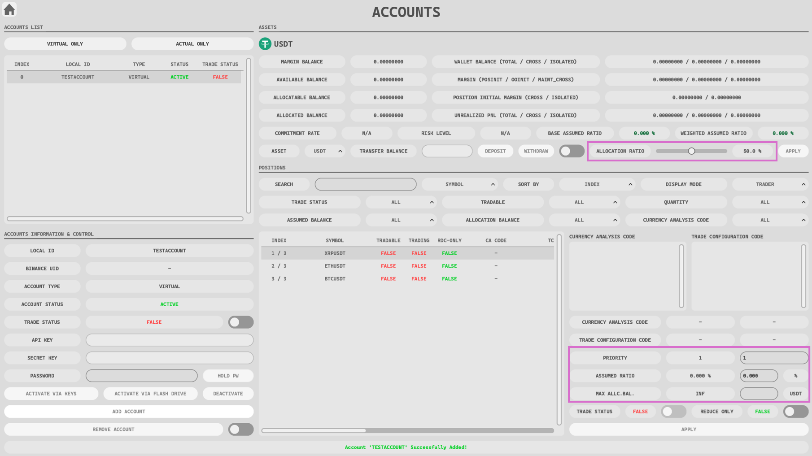

  Account Control achieves portfolio risk management and capital distribution by defining the four parameters below.

  | Parameter                 | Target   | Description |
  | :---:                     | :---:    | :--- |
  | Allocation Ratio          | Asset    | Determines the percentage of the total *Available Balance* to be utilized for trading activities |
  | Assumed Ratio             | Position | Determines the percentage of the *Asset Allocated Balance* assigned to a specific position |
  | Priority                  | Position | Defines the funding order. If the sum of all Assumed Ratios exceeds 100%, positions with higher priority (1 being the highest priority) are funded first |
  | Maximum Allocated Balance | Position | A hard cap limiting the maximum capital allocated to a specific position |
   
  $$\text{Asset Allocated Balance} = \text{Available Balance} \times \color{orange}{\text{Allocation Ratio}}$$
  $$\text{Position Allocated Balance} = \min(\text{Asset Allocated Balance} \times \color{orange}{\text{Assumed Ratio}}, \color{orange}{\text{Maximum Allocated Balance}})$$
   
  

---

### 👀 Application Preview & How To Use ###
* 

  
<b><i> Pages </b></i>

  * 
 
      
<b><i> Dashboard </b></i>

      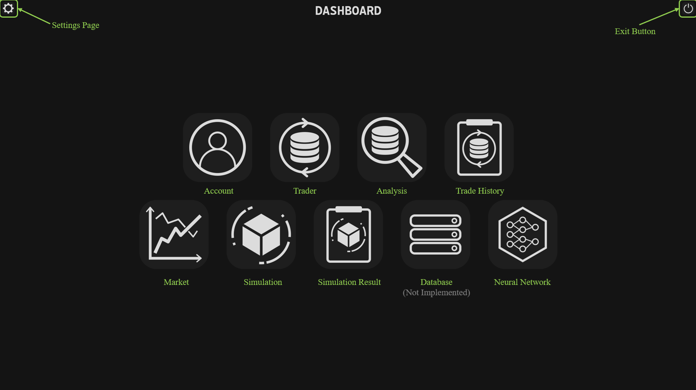
      The central hub for navigation and application control.

      1\. Navigate to other pages.  
      2\. Terminate the application.  
    

  * 
 
      
<b><i> Accounts </b></i>

      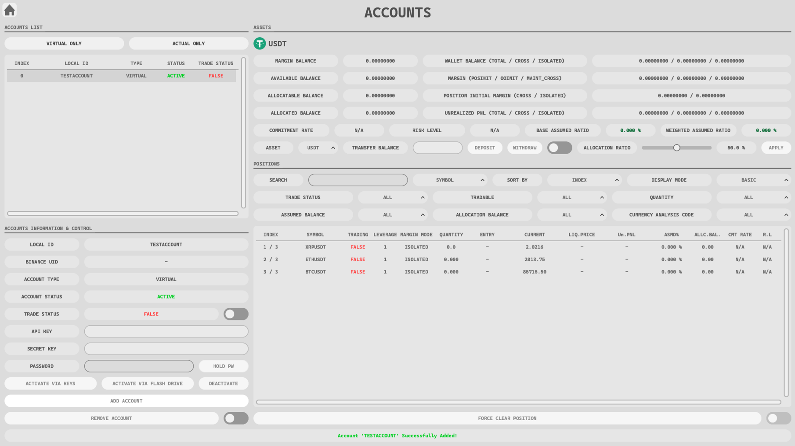
      Manage virtual and actual trading accounts.

      1\. Create local virtual account instances.  
      2\. Create local actual account instances and synchronize with Binance.  
      3\. View account assets and position data.  
      4\. Configure trade settings for assets and positions.  
      5\. Monitor position-specific trade variables.  
    

  * 
 
      
<b><i> AutoTrade </b></i>

      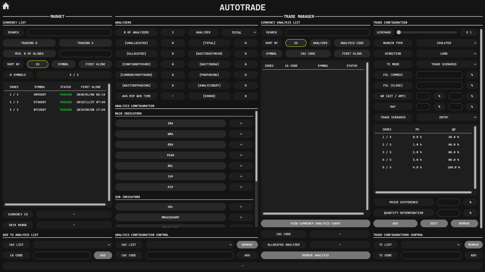
      Configure automated analysis and trading strategies.
      
      1\. Monitor Analyzers status.  
      2\. Create Currency Analysis Configurations (CAC).  
      3\. Initialize currency analysis by selecting a CAC and a target symbol.  
      4\. View the list and status of active currency analyses.  
      5\. Create Trade Configurations (TC).  
    

  * 
 
      
<b><i> Currency Analysis </b></i>

      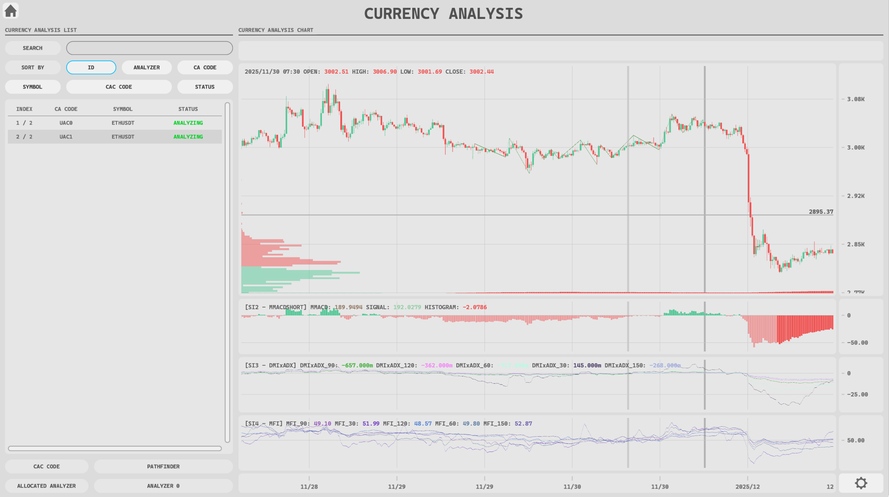
      Visualize and inspect market analysis data.

      1\. Select a currency analysis instance to view its chart.  
      2\. Inspect the CAC applied to the selected analysis.  
    

  * 
 
      
<b><i> Account History </b></i>

      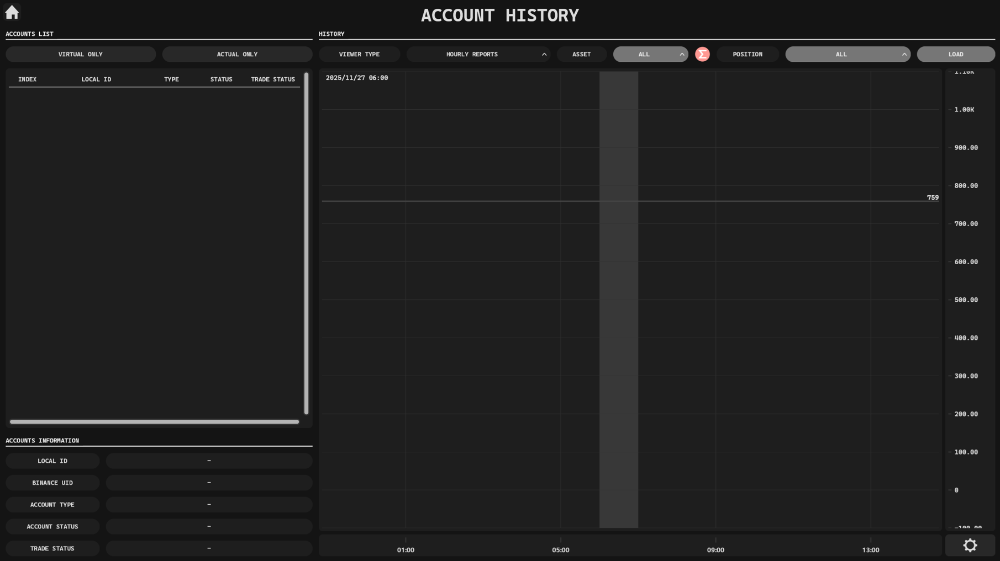
      Review historical performance and logs.

      1\. View trade logs and balance history for actual/virtual accounts.
    

  * 
 
      
<b><i> Market </b></i>

      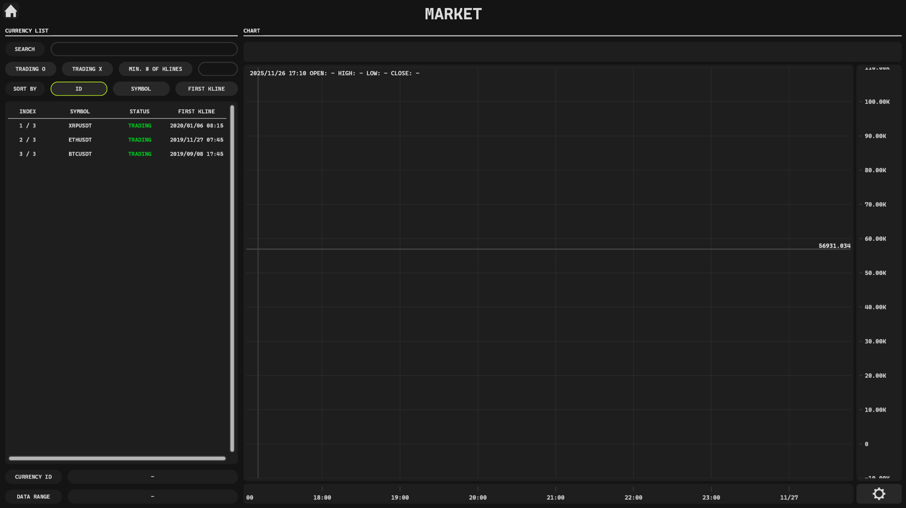
      Real-time market monitoring.

      1\. View the list of current market positions.  
      2\. Access position charts.  
      3\. Perform temporary currency analysis on a specific time window.  
    

  * 
 
      
<b><i> Simulation </b></i>

      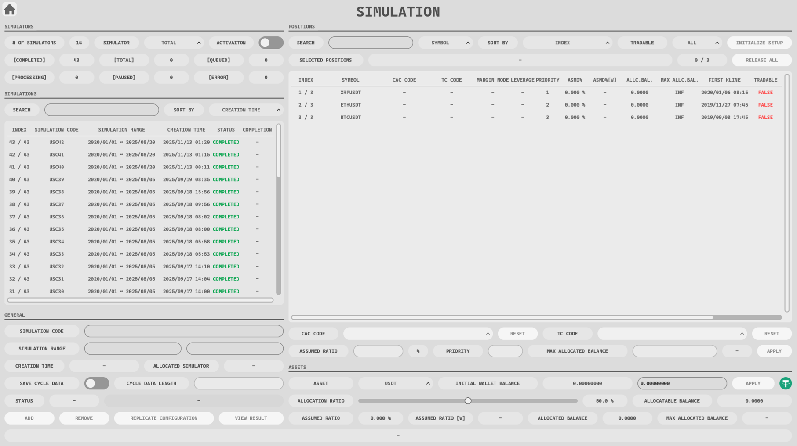
      Run backtests to verify the performances of customized trade strategies.

      1\. View the list of completed and processing simulations.  
      2\. Import trade configurations from existing simulations.  
      3\. Backtest specific strategies, variables, and ranges on target positions.  
    

  * 
 
      
<b><i> Simulation Result </b></i>

      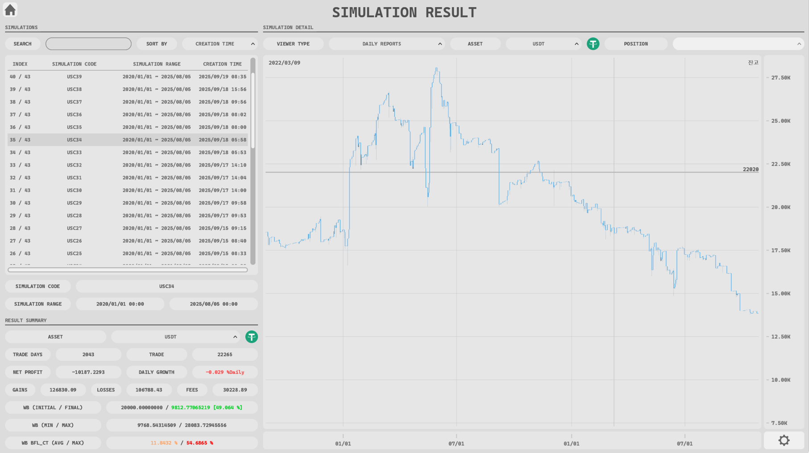
      Analyze simulation results.
      
      1\. View completed simulations and result summaries.  
      2\. Inspect account balance history.  
      3\. Review simulation setups (positions, CAC, TC).  
      4\. View detailed trade logs.  
      5\. Reconstruct currency analysis charts for a detailed inspection.  
    

  * 
 
      
<b><i> Database (Not Implemented) </b></i>

      This page is currently under development.
    

  * 
 
      
<b><i> Neural Network </b></i>

      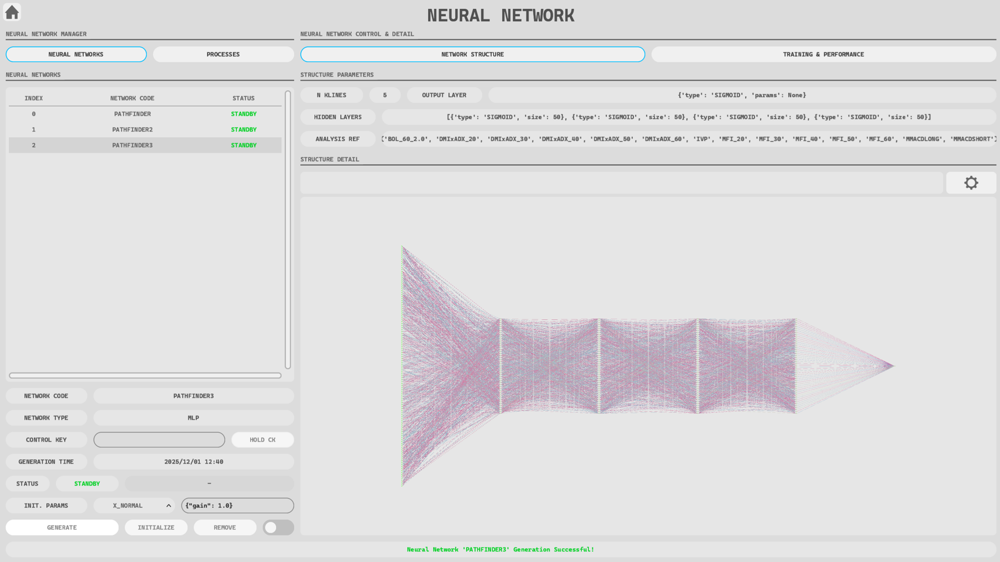
      Design and train Machine Learning models.

      1\. Design custom Multi-Layer Perceptron (MLP) models.  
      2\. Train models using historical market data.  
      3\. Analyze training performance and results.  
    

  * 
 
      
<b><i> Settings </b></i>

      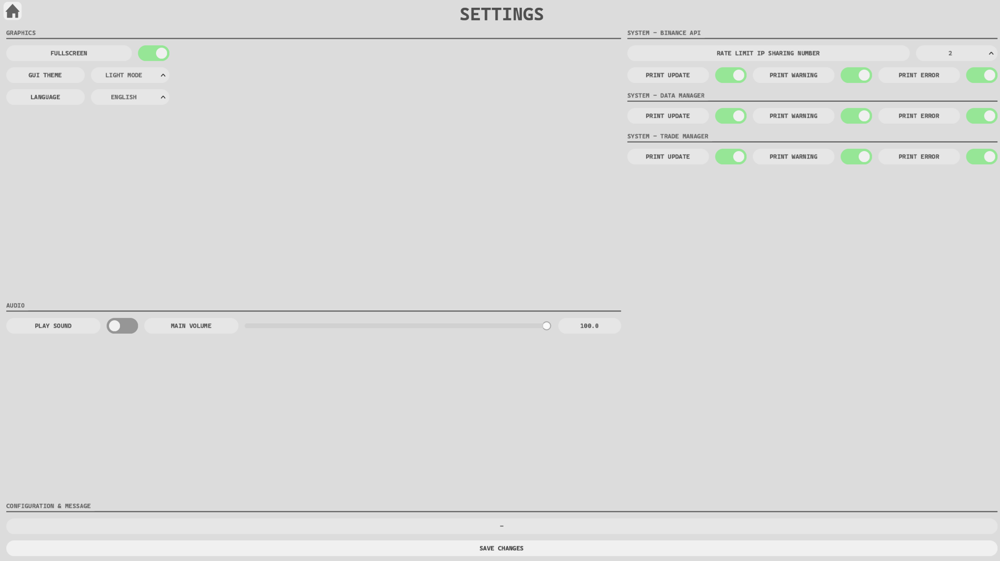
      Configure application preferences.

      1\. Change language.  
      2\. Switch GUI theme (Light/Dark Mode).  
      3\. Toggle fullscreen mode.  
      4\. Manage audio settings.  
      5\. Set the terminal log display level.  
    

  

* 

  
<b><i> Features </b></i>

  * 

    
<b><i> Viewing Market & Performing Temporary Currency Analysis </b></i>

      1\. Navigate to the **Market** page.
      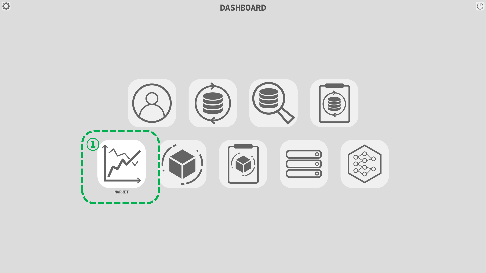
       

      2\. Select a target position.  
      3\. Click the settings button on the chart drawer.
       
       

      4\. Configure currency analysis parameters.
       
       

      5\. Set the analysis range and start the analysis.
      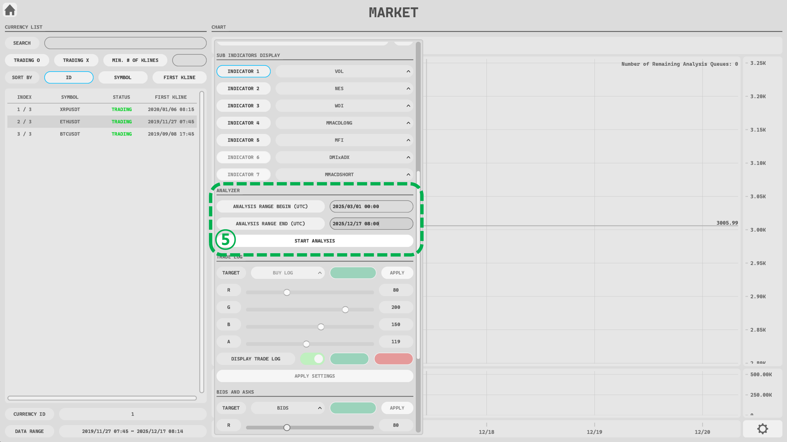 
       

      6\. View the analysis results.
      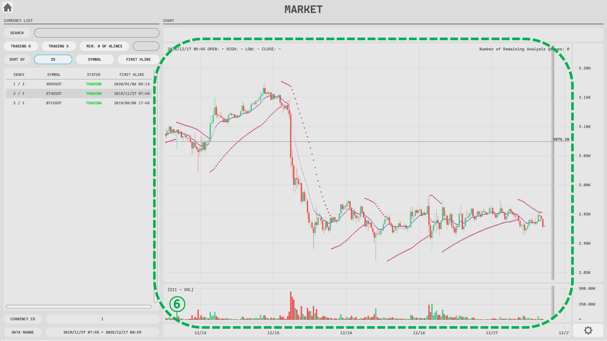

    

  * 

    
<b><i> Adding a Currency Analysis </b></i>

      1\. Navigate to the **AutoTrade** page.
      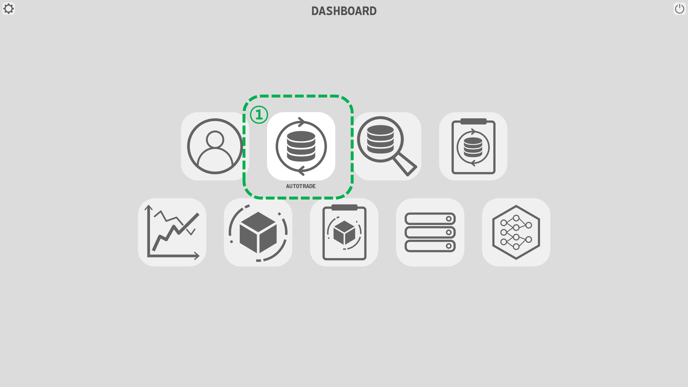
       

      2\. Configure currency analysis parameters.  
      3\. Name the configuration (auto-generated if left blank)and click **ADD**.
      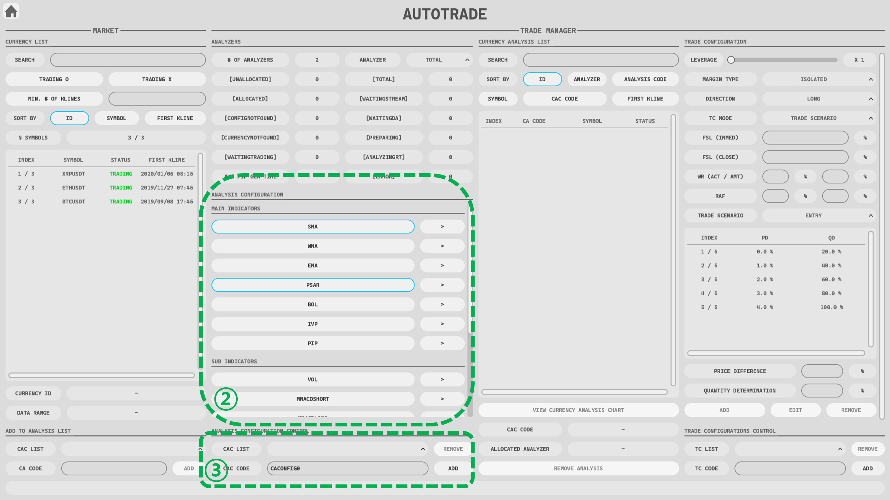
       

      4\. Select a target position from the market list.  
      5\. Select a CAC to apply, name the analysis instance (auto-generated if left blank)and click **ADD**.  
      
       

      6\. Review the list of analysis instances. Click **VIEW CURRENCY ANALYSIS CHART** to open the chart.  
      
       

      7\. Monitor the currency analysis.  
      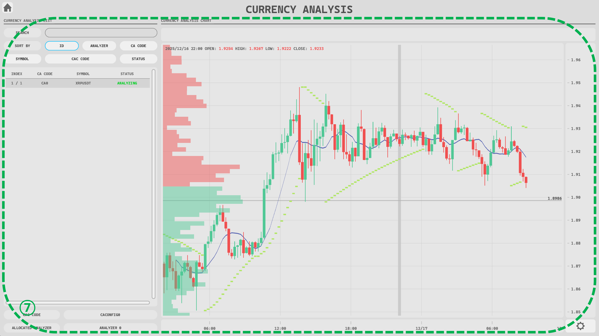
       

    

  * 

    
<b><i> Adding a Trade Control Configuration </b></i>

      1\. Navigate to the **AutoTrade** page.  
      
       

      2\. Configure trade control parameters.  
      3\. Name the configuration (auto-generated if left blank)and click **ADD**.  
      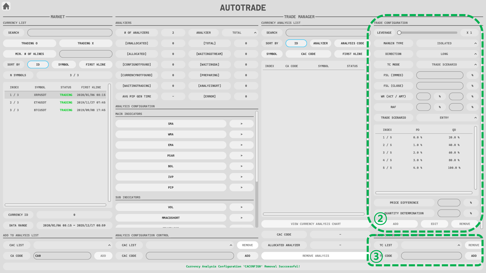
       

    

  * 

    
<b><i> Backtesting & Results </b></i>

      1\. Navigate to the **Simulation** page.  
      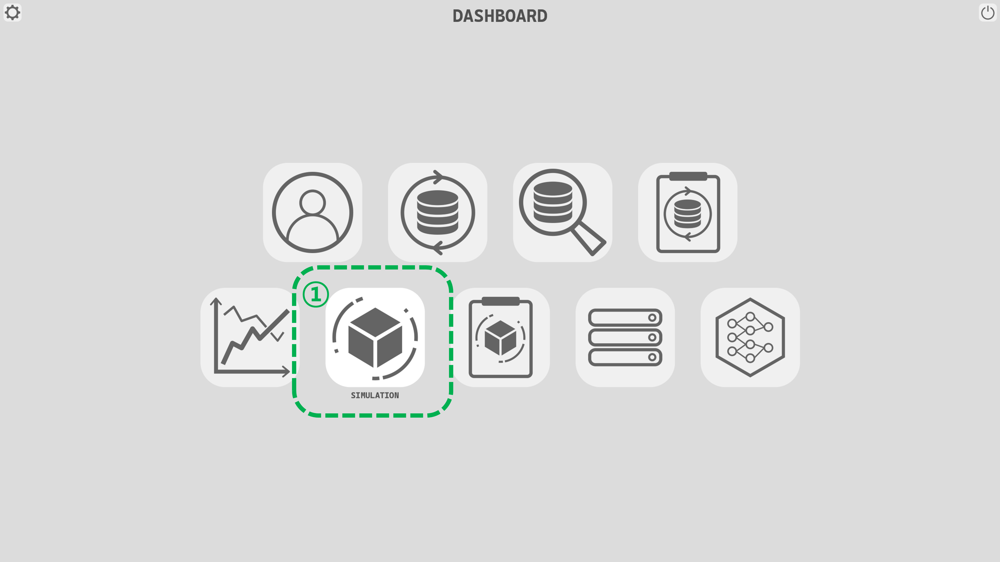
       

      2\. Set the simulation name (auto-generated if left blank) and range.  
      &nbsp; Once all the configurations are completed, click **ADD** (Once step 3 and 4 are done).  
      &nbsp; Once the simulation is completed, move to **SIMULATION RESULT** page either by clicking **VIEW RESULT** or navigating from **DASHBOARD**.  
      3\. Configure position-specific strategies (Currency Analysis, Trade Control, Account Control)  
      4\. Determine account-level parameters.  
      
       

      5\. Select a simulation.  
      6\. View the simulation result summary.  
      7\. Inspect the simulation result details.  
      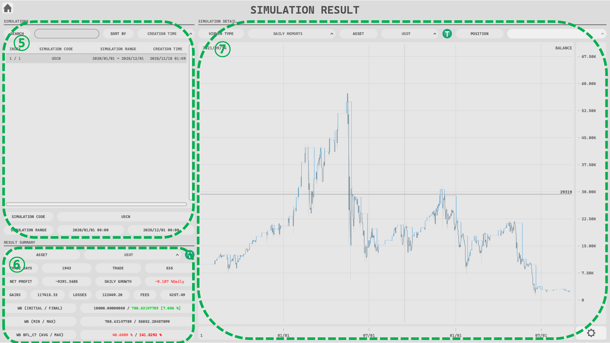
       

    

  * 

    
<b><i> Adding Accounts & Automated Trading </b></i>

      1\. Navigate to the **Accounts** page.  
      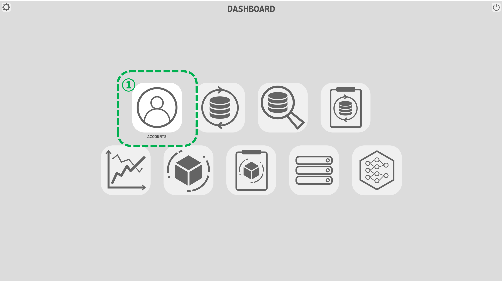
       

      2\. Enter account details and click **ADD ACCOUNT**.  
      &nbsp; [ACTUAL ONLY] Enter Binance User ID.  
      
       

      3\. View the selected account's information.  
      &nbsp; [ACTUAL ONLY] Activate the account by entering your Binance API Key and Secret Key. This will synchronize the local account instance with the real account in Binance.  
      4\. Monitor asset information and position status.  
      5\. Monitor and configure trade strategies for specific positions.
      
       

      6\. Navigate to the **Account History** page.  
      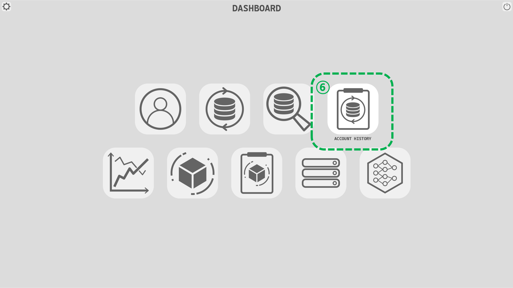
       

      7\. Select an account from the list.  
      8\. Toggle the view type to check either the balance history chart or trade logs.  
      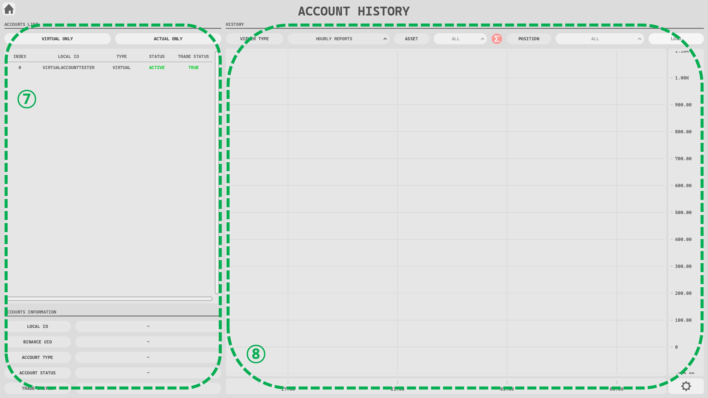
       

    

  * 

    
<b><i> Creating and Training a Neural Network Model </b></i>

      1\. Navigate to the **Neural Network** page.  
      
       

      2\. Configure model parameters: Name, Type, Control Key, and Initialization Method.   
      3\. Define the neural network structure (Layers/Nodes/Analysis References).  
      
       

      4\. Select a model from the list.  
      5\. Visualize the network structure.  
      
       

      6\. Select historical market data to train the model on, and set training parameters.  
      
       

      7\. Monitor the training process.  
      8\. Review training results and performance metrics.  
      
       

    

  

  
---

### 🤝 Credits
* **[python-binance](https://github.com/sammchardy/python-binance)** by *sammchardy* (MIT License)  
  - This project includes a modified version of `python-binance`. An option to disable the first kline search within the `futures_historical_klines` function in `client.py` module was added. 

---

### 🗓️ Project Duration
* September 2024 – November 2025

---

### 📄 Document Info
* **Last Updated:** December 23rd, 2025  
* **Author:** Bumsu Kim
* **Email:**  kimlvis31@gmail.com
