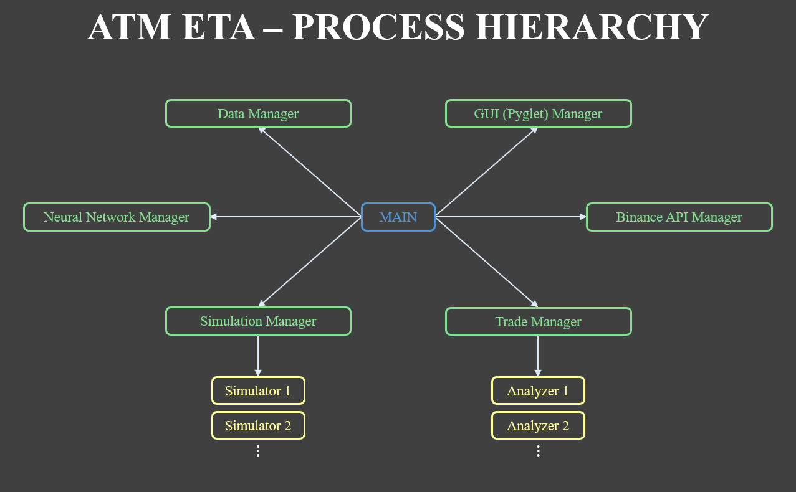

# AutoTradeMachine_Eta

---
### 📖 Project Introduction ###
This is the seventh and the first operational version of the **Auto Trade Machine** project. 

This all-in-one application serves as a comprehensive platform for backtesting and automated trading on Binance Futures. Upon launch, it automatically connects to the exchange to fetch and retain market data locally, allowing users to rapidly experiment with custom strategies. The application is designed to streamline the 'Build-Test-Execute' trade strategy development cycle, enabling a seamless transition from backtesting to live trading.  
Additionally, it includes several experimental features, such as a basic Neural Network model (Multi-Layer Perceptron), deep market data collection (Orderbook and AggTrades), volume profile interpretation, etc.

To demonstrate the application's potential capabilities, I would like to share my automated trading experience on this application.  

* **Duration:** Running 24/7 since August 24, 2025 (~4 Months) with weekly application restarts.
* **Cryptocurrencies:** `BTCUSDT`, `ETHUSDT`, `XRPUSDT` on Binance Futures.
* **Backtest Result:** ~150x growth over 5 years with ~35% maximum drawdown.
* **Account Balance History:**  
  * **Initial:** $4,718.55  
  * **Minimum:** $4,022.05  
  * **Maximum:** $6,603.11  
  * **Current:** $5,640.23  

The average monthly profit has been around 4.9%, so I have been quite lucky so far. It must be noted, however, that **this application does not guarantee profit**, but only serves as a platform on which users can find their own ways to generate it.

---

### ▶️ How To Run ###
* ***Windows*** 🪟
1. Run `setup.bat` in the root directory. This will setup .venv to install any necessary libraries for this application.
2. Run `run.bat` in the root directory. This will start the application.

* ***Linux*** 🐧
1. Execute the command `chmod +x setup.sh run.sh` in the terminal.
2. Run `setup.sh` in the root directory. This will setup .venv to install any necessary libraries for this application.
3. Run `run.sh` in the root directory. This will start the application.

---

### ✅ Requirements ###
* **Operating System**: Windows 10/11 or Linux
* **Python**:           Version `3.9` or higher
* **CPU**:              Minimum 8-core CPU
* **RAM**:              16GB or more
* **Storage**:          10GB or more

---

### 🧩 Limitations & Current Issues ###
There are some problems that need to be addressed for the application to prove itself more reliable.

* **⚠️ [IMPORTANT] Data Collection Discontinuities**  
  During periods of high market volatility, the application may experience intermittent WebSocket stream disconnections. This instability typically arises from the following factors:
   
  
  1. **Internal Queue Overflow:**
  The application utilizes the `python-binance` library, which employs a threaded WebSocket manager with an internal message buffer. During extreme data volume spikes, this buffer may exceed its capacity, triggering a `queue overflow` exception and terminating the connection. Although the buffer size has been significantly expanded to handle most scenarios, overflows can still occur during unprecedented market activity.
   

  2. **Unstable Network Connection:** 
  The application performs periodic REST API calls to verify server connectivity. Network instability can cause these checks to fail, which the system interprets as a connection loss, triggering a full re-initialization sequence. This recovery process is expensive; it requires fetching missing data via REST API while adhering to strict rate limits. This latency creates unavoidable gaps in data collection, potentially resulting in **PIP signal loss** (detailed in the Strategy section).
   

  3. **Server Overload:** 
  The exchange server may forcefully terminate WebSocket connections during periods of extreme load to ensure overall system stability. Since this behavior originates from the server side, it is inherently unpredictable and difficult to prevent completely.
   
  
  4. **Ping/Pong Mechanism:** 
  To monitor connection status, the Binance server sends a `ping` frame every 3 minutes and expects a `pong` response within 10 minutes. If this handshake fails - potentially due to network latency or application load - the server terminates the connection. While the exact root cause remains under investigation, it is suspected to be linked to transient network instability and the triggered internal connection recovery mechanism.

* **Limited Flexibility In Trade Strategy Customization**  
  Due to its architectural structure, the only means of trade strategy customization currently is adjusting the parameters of pre-existing trading schemes. Consequently, implementing entirely new trade logic requires modifying and testing the source code itself. While this hard-coded approach offers the advantage of runtime stability, it severely restricts flexibility. Furthermore, verifying new logic can be a complex and error-prone process. I recognize that this rigidity contradicts the core purpose of this application. Addressing this issue requires a complete structural redesign, which is planned for the next major version.

* **All-In-One Structure**   
  This application follows an all-in-one architecture, originally adopted to reduce system complexity and enhance user experience. However, this design presents a challenge regarding data collection continuity. While historical Kline (candlestick) data can be retrieved at any time, Binance (and any other exchanges) do not provide historical **Orderbook** or **Executed Trades** data. Consequently, this data must be collected in real-time without interruption. The current architecture requires a full application restart to update any individual module (e.g., Simulator, Trader, GUI), which inevitably severs the data collection stream. These gaps in data compromise the reliability of base datasets for backtesting purposes.

* **Static Process Allocation**  
  All processes in this application are initialized upon launch and persist until termination. Since the numbers of analyzer and simulator processes are dynamically determined by the remaining CPU cores, a 24-core system spawns 24 independent processes that remain active even when there are no tasks to perform. Given that Python processes have a significant memory footprint, this architecture leads to highly unnecessary resource consumption. While core managers (e.g., BinanceAPI, Data, Trader) must remain active, keeping Analyzer and Simulator processes alive during inactivity results in substantial overhead. Consequently, on a 24-core environment, the application can consume nearly 10GB of RAM even in an idle state. I plan to implement a dynamic process lifecycle management system in the next version to resolve this issue.

* **Inefficient Polling-Based Processes & IPC Threads**  
  Currently, the system utilizes a loop-based polling mechanism (with `1ms` sleep) for processes and IPC threads. While this approach ensures sequential task execution, it is inherently inefficient compared to event-driven architectures. The frequent wake-up cycles force unnecessary computations and can result in increased latency becoming a significant bottleneck. This design choice was made during the project's early stages to prioritize implementation simplicity. To remove this unnecessary inefficiency and resource waste, blocking-queue or interrupt-based model will be considered in the next version.

* **Minor GUI Bugs**  
  Listed below are the currently known GUI-related issues. While they can be a nuisance, their impact on the application's core performance is negligible. I believe they can eventually be fixed, but I have not had enough time to invest in them yet.
   
  &nbsp; 1\. Text input box becomes increasingly laggy when holding a long text. Lag becomes noticeable when the length exceeds 30.
   
  &nbsp; 2\. Chart drawer and daily report viewer become slow when scaling in/out over a large time domain or data range.
   
  &nbsp; 3\. Selection box graphics lose synchronization between input and display coordinates when coordinate values exceed around a million.

---

### 🧱 System Architecture ###
The image below shows a simplified diagram of the multiprocessing structure of ATM-Eta.
  

  
Each of the processes communicate with each other via `IPCAssistant` class defined in the `atmEta_IPC.py` module. Described below is the task and characterstic of each process.

* **Main**  
Upon the application launch, identifies the system requirements, determine number of simulators and analyzers to generate, configure IPCs, and generate and start processes.

* **GUI Manager**  
Manages graphics and audio resources, interaction objects, and display objects to serve as a hub connecting the user and teh manage processes.

* **Binance API Manager**  
Responsible for market data fetch, stream connection, order placement, API rate-limit management, etc. It is one of the most vital parts of this application.

* **Data Manager**  
Keeps track of local market, account, simulation, and neural network data. Enables other managers to easily perform CRUD operations with the local DB.

* **Trade Manager**  
Manages all the tasks related to trading. These tasks include account connection (through the Binance API Manager), currency analysis and trade configuration management, trade logic determination, analyzer allocation, etc.

* **Analyzer**  
The number of analyzers are determined by the **main process** depending on the number of CPU cores and by the `ASRatio` in the `programConfig.config` file.  
`number of analyzers = (number of CPU cores - 8) * ASRatio`  
When the user adds a currency analysis, the analysis task is allocated to the most relevant or free analyzer process by the **Trade Manager**. The analyzer then request market data from the **Binance API Manager** and **Data Manager**, perform analysis, and dispatch generated `PIP (Potential Investment Plan)` signals to the **Trade Manager**.

* **Simulation Manager**  
Manages all the simulation processes and history. When the user configures a simulation setup and sends a queue append request, **simulation manager** reformats the configuration, allocate the task to the most appropriate simulator process, and keeps track of the task process until complete.

* **Simulator**  
The number of simulators are determined by the **main process** depending on the number of CPU cores and by the `ASRatio` in the `programConfig.config` file (same as with analyzers, but inversly proportional).  
`number of simulators = (number of CPU cores - 8) * (1 - ASRatio)`   
dsad

* **Neural Network Manager**  
This is an experimental neural network module to examine any possible effectiveness of neural network models in trading. It enables users to configure, initialize, and train models on historical market data which can later be imported by `Analyzers` or `Simulators` to provide an additional reference of market analysis.

---

### 🧠 Trade Strategy ### 

A trade strategy in this application refers to a set of three processes - currency analysis, trade control, and account control. Starting from raw market data, each of these processes uses a pre-defined model and configuration to eventually generate order requests that are sent to the exchange server to be executed.

* 

  
<b><i> Currency Analysis Configuration </b></i>

  Aside from the vanilla forms of the well-known technical analysis tools such as SMA, PSAR, and BOLs, currency analysis in this application also provides 6 fusioned or modified tools for easier signal interpretations. The signals are then collected, and interpreted by a method called PIP (Potential Investment Plan). This method can be considered a technical analysis tool just like others, except that it uniquely generate signals that can directly be used by trade control process.

  * 
 
    
<b><i> IVP (Interpreted Volume Profile) </b></i>

    
    

    This analysis method is fundamentally the same as what is famously known as VPVR (Volume Profile Visible Range). By summing the trade volumes over a certain price range, a volume profile at a specific point in time can be created. The volume profile is then filtered to remove noise and identify major price levels. The second image above shows the filtered volume profile on the right side (VPLP), and the identified major support and resistance lines (VPLPB).
    
    The table below shows the analysis parameters for IVP.
     
    | Parameter    | Description |
    | :---:        | :---: |
    | Interval     | Number of minimum samples to build a volmume profile. The samples that are older than this number of intervals are NOT excluded |
    | Gamma Factor | Determines the volume profile division height |
    | Delta Factor | Determins the filter strength |
     

    

  * 
 
    
<b><i> MMACD (Multi Moving Average Convergence and Divergence) </b></i>

    
    

    As its name suggests, this is a modified version of the technical analysis method MACD (Moving Average Convergence and Divergence). While the classical version only shows the relationship between two moving averages, MMACD is extended to be able to include upto 6 moving averages. In addition, MMACD experimentally allows kline interval multiplication, which is used to effective generate analysis on higher temporal interval. For instance, if having multiplier set to 4 imitates an analysis on 1h interval domain while being on 15m interval domain. This is also the reason why there exist two MMACDs; MMACDSHORT and MMACDLONG.

    | Parameter       | Description |
    | :---:           | :---: |
    | Signal Interval | Number of samples for signal |
    | Multiplier      | Number of kline multiples |
    | MA Interval     | Moving average interval |

    

  * 
 
    
<b><i> DMIxADX (Directional Movement Index and Average Directional Index) </b></i>

    
    

    DMI (Directional Movement Index) is an indicator that helps identify the strength and direction of a market trend.
    ADX (Average Directional Index) is an indicator that measures the trend strength.

    This is why DMI and ADX are combined to be used as a single analysis tool in this application. All-Time-High, ATH Relative, 

    | Parameter | Description |
    | :---:     | :---: |
    | Interval  | Number of samples for signal |

    

  * 
 
    
<b><i> MFI (Money Flow Index) </b></i>

    
    

    MFI (Money Flow Index) is a momentum oscillator to measure buying and selling pressure by combining price and volume. Like DMIxADX, this tool used normalization technique using ATH.

    | Parameter | Description |
    | :---:     | :---: |
    | Interval  | Number of samples for signal |

    

  * 
 
    
<b><i> WOI (Weighted Order Imbalance) </b></i>

    This is an technical experiment

    
    | Parameter | Description |
    | :---:     | :---: |
    | Interval  | Number of samples for signal |
    | Sigma     | Number of samples for signal |

    

  * 
 
    
<b><i> NES (Net Execution Strength) </b></i>

    This is an technical experiment

    | Parameter | Description |
    | :---:     | :---: |
    | Interval  | Number of samples for signal |

    

  * 
 
    
<b><i> PIP (Potential Investment Plan) </b></i>

    
    

    This is the central hub of all the indicators in which the currency analysis finally generates any interpretable output.

    | Parameter      | Description |
    | :---:          | :---: |
    | SWING Range    | High-Low Swing Points Range |
    | Neural Network | Neural Network Model |
    | NNA Alpha      | Neural Network Analysis Signal Filtering Parameter 1 |
    | NNA Beta       | Neural Network Analysis Signal Filtering Parameter 2 |
    | CS Alpha       | Classical Signal Filtering Parameter |
    | CS nSamples    | Classical Signal Filtering Number of Samples |
    | CS Sigma       | Classical Signal Filtering Parameter 1 |
    | CS AT1         | Classical Signal Activation Threshold 1 |
    | CS AT2         | Classical Signal Activation Threshold 2 |
    | WS AT          | Activation Threshold for WOI Signal |
    | AS Mode        | Action Signal Type |

    | Keyword | Description |
    | :---:   | :---: |
    | AT      | Activation Threshold |
    | NNA     | Neural Network Analysis |
    | CS      | Classical Signal |
    | WS      | WOI Signal |
    | AS      | Action Signal |

    

  

* 

  
<b><i> Trade Control Configuration </b></i>

  

  Trade Control is a process in which potential trade orders are created from the PIP signals generated by currency analysis. This is done by identifing the current position within the trade cycle and corresponding pre-determined reaction models.
  Currently there are two trade control methods implemented; TS (Trading Scenario) and RQPM (Remaining Quantity Percentage Map).

  * 
 
    
<b><i> TS (Trading Scenario) </b></i>

    This is a very primitive type of trade control method. Its idea is extremely simple. The user configures each step of a trade cycle (from position enterance to exit). 
    Each step consists of three parameters; index, PD (price delta), and QD (quantity determination).

    | Parameter | Description |
    | :---:     | :---: |
    | Index     | The order of the step |
    | PD        | Price difference from the initial entrance price |
    | QD        | Quantity percentage to reach relative to the position allocated balance|

    | Parameter    | Contents   | Description |
    | :---:        | :---:      | :---: |
    | FSL (IMMED)  | ACT        | The order of the step |
    | FSL (CLOSED) | ACT        | Price difference from the initial entrance price |
    | WR           | ACT, AMT   | Quantity percentage to reach relative to the position allocated balance |
    | RAF          | ACT1, ACT2 | Quantity percentage to reach relative to the position allocated balance |

    

  * 
 
    
<b><i> RQPM (Remaining Quantity Percentage Map) </b></i>

    The fundamental idea of this method is the same as TS. The difference is while status positional varialbe was limited to index and pride delta for TS, RQPM allows the use of PIP signal to construct a position model, and output quantity percentage
    using a model function. Currently there is only one function type called 'ROTATIONALGAUSSIAN'.  

    $$
    RQP (Remaining Quantity Percentage) = f(PIPSS (PIP Subsignals))
    $$

    | Parameter    | Contents | Description |
    | :---:        | :---:    | :---: |
    | FSL (IMMED)  | ACT      | The order of the step |
    | FSL (CLOSED) | ACT      | Price difference from the initial entrance price |
    | EOI          | ACT      | Minimum PIP signal impulse strength over which position exit is allowed |
    | EOA          | ACT      | Minimum PIP signal impulse strength over which position exit is allowed |
    | EOP          | ACT      | Minimum price delta relative to the entry price over which position exit is allowed |

    

  

* 

  
<b><i> Account Control Configuration </b></i>

  

  By setting the four major parameters below, the user can proportionalize their investment portfolio.

  | Parameter                 | Target   | Description |
  | :---:                     | :---:    | :---: |
  | Allocation Ratio          | Asset    | Determines the amount of asset balance to use for trading |
  | Assumed Ratio             | Position | Determines the amount of asset balance to use for the position |
  | Priority                  | Position | Determines which position to prioritize, when the amount of remaining asset balance is not enough to provide for all of the positions. (Occurs when the sum of Assumed Ratio exceeds 100%) |
  | Maximum Allocated Balance | Position | The maximum amount of asset balance to allocate for the position |
   
  $$
  \text{Asset Allocated Balance} = \text{Available Balance} \times \color{orange}{\text{Allocation Ratio}}
  $$
   
  $$
  \text{Position Allocated Balance} = \min(\text{Asset Allocated Balance} \times \color{orange}{\text{Assumed Ratio}}, \color{orange}{\text{Maximum Allocated Balance}})
  $$
   
  

---

### 👀 Application Preview & How To Use ###
Once the program starts, a GUI window will open up letting the user to nagivate through different pages for each different tasks.

* 

  
<b><i> Pages </b></i>

  * 
 
      
<b><i> Dashboard </b></i>

      
      This is the *Dashboard* page. In this page, the user can

      1. Navigate to other pages  
      2. Terminate the application  
    

  * 
 
      
<b><i> Accounts </b></i>

      
      This is the *Accounts* page. In this page, the user can  

      1. Create a local virtual account instance
      2. Create a local actual account instance / link to Binance account  
      3. View account asset / position data
      4. Determine the trade configurations of assets / positions.
      5. View position-wise trade control variable details.
    

  * 
 
      
<b><i> AutoTrade </b></i>

      
      This is the *AutoTrade* page. In this page, the user can  
      
      1. View Analyzers status.
      2. Create a currency analysis configuration (CAC)
      3. Add a currency analysis by choosing a CAC and a symbol to analyze.
      4. View currency analysis list and status
      5. Create a trade configuration (TC)
    

  * 
 
      
<b><i> Currency Analysis </b></i>

      
      This is the *Currency Analysis* page. In this page, the user can  

      1. Choose a currency analysis and view its chart.
      2. View the CAC applied to the currently chosen currency analysis
    

  * 
 
      
<b><i> Account History </b></i>

      
      This is the *Account History* page. In this page, the user can  

      1. View actual/virtual account trade logs and balance history.
    

  * 
 
      
<b><i> Market </b></i>

      
      This is the *Market* page. In this page, the user can  

      1. View current market positions list
      2. View a position chart
      3. Configure a temporary currency analysis, and analyze on the determined temporal window.
    

  * 
 
      
<b><i> Simulation </b></i>

      

      This is the *Simulation* page. In this page, the user can  
      1. View completed/processing simulation lists
      2. Copy trade configurations from the chosen simulation
      3. Backtest the configured target positions, trade strategies, initial variables, and simulation range.
    

  * 
 
      
<b><i> Simulation Result </b></i>

      

      This is the *Simulation Result* page. In this page, the user can  
      1. View the completed simulations and their result summary.
      2. View account balance history.
      3. View simulation position setups, currency analysis configurations and trade configurations.
      4. View trade logs.
      4. Reconstruct currency analysis and view chart.
    

  * 
 
      
<b><i> Database (Not Implemented) </b></i>

      This is the *Database* page. This page is not implemented.
    

  * 
 
      
<b><i> Neural Network </b></i>

      

      This is the *Neural Network* page. In this page, the user can  

      1. Create a custom designed MLP (Multi-Layer Perceptron) model.
      2. Train the models using the chosen historical market data.
      3. View training results
    

  * 
 
      
<b><i> Settings </b></i>

      
      
      This is the *Settings* page. In this page, the user can  
      1. Change the langauge
      2. Change the GUI theme (Light Mode or Dark Mode)
      3. Toggle fullscreen mode
      4. Toggle or adjust audio
      5. Determine log display level on terminal
    

  

* 

  
<b><i> Features </b></i>

  This section describes the key features of this application step-by-step guide on how to use those features.

  * 

    
<b><i> Viewing Market & Perform Temporary Currency Analysis </b></i>

      1\. Navigate to Market page.
      
       

      2\. Select a position.  
      3\. Click on settings button on the chart drawer.
       
       

      4\. Configure currency analysis.
       
       

      5\. Determine analysis range and start analysis.
       
       

      6\. View analysis result.
      

    

  * 

    
<b><i> Adding a Currency Analysis </b></i>

      1\. Navigate to AutoTrade page.
      
       

      2\. Configure currency analysis parameters.  
      3\. Name the configuration and add (If left unnamed, it will be automatically generated in an indexed format).
      
       

      4\. Select a position to generate analysis on from the market.
      5\. Name the currency analysis instance and add (If left unnamed, it will be automatically generated in an indexed format).
      
       

      6\. View the list of currency analysis instances. To view the chart, click the ***VIEW CURRENCY ANALYSIS CHART*** button.
      
       

      7\. View the selected currency analysis.
      
       

    

  * 

    
<b><i> Adding a Trade Control Configuration </b></i>

      Adding a currency analysis requires a CAC and a target position.

      1\. Navigate to AutoTrade page.
      
       

      2\. Configure trade control parameters, name the configuration, and add (If left unnamed, it will be automatically generated in an indexed format).
      
       

    

  * 

    
<b><i> Backtesting & Results </b></i>

      1\. Navigate to Simulation page.
      
       

      2\. Determine simulation name and range (If left unnamed, it will be automatically generated in an indexed format).  
      Once all the configurations are completed, click the ***ADD*** button (Once step 3 and 4 are done).  
      Once the simulation is completed, move to ***SIMULATION RESULT*** page either by pressing the ***VIEW RESULT*** button in the section or by navigating from **DASHBOARD**.
      3\. Determine position-wise trade strategies; currency analysis, trade control, and account control.
      4\. Determine account-wise parameters.
      
       

      5\. Select a simulation to view
      6\. View simulation result summary
      7\. View simulation result in details.
      
       

    

  * 

    
<b><i> Adding Accounts & Automate Trading </b></i>

      1\. Navigate to Accounts page.
      
       

      2\. Fill in accounts information and create.  
      [ACTUAL ONLY] Enter Binance User ID.
      
       

      3\. View the selected account's information.
      [ACTUAL ONLY] Activate the account by entering the API Key and the Secret Key provided by Binance.  
      4\. View account asset information.
      5\. View position-wise information and configure trade strategies here.
      
       

      6\. Navigate to Account History page.
      
       

      7\. Select an account to view.
      8\. Select from the viewer type to view either the historical account balance chart or trage logs.
      
       

    

  * 

    
<b><i> Creating and Training a Neural Network Model </b></i>

      1\. Navigate to Neural Network page.
      
       

      2\. Determine the neural network name, type, control key, and initialization method.
      3\. Configure neural network structure.
      
       

      4\. Select a neural network to view.
      5\. View the visualized neural network structure.
      
       

      6\. Select a historical market data to train the model on, and training parameters.
      
       

      7\. View training processes.
      8\. View training result and performance test records.
      
       

    

  

  
---

### 🤝 Credits
* **[python-binance](https://github.com/sammchardy/python-binance)** by *sammchardy* (MIT License)  
  - This project includes a modified version of `python-binance`. An option to disable the first kline search within the `futures_historical_klines` function in `client.py` module was added. 

---

### 🗓️ Project Duration
* September 2024 – November 2025

---

### 📄 Document Info
* **Last Updated:** December 22th, 2025  
* **Author:** Bumsu Kim
* **Email:**  kimlvis31@gmail.com
